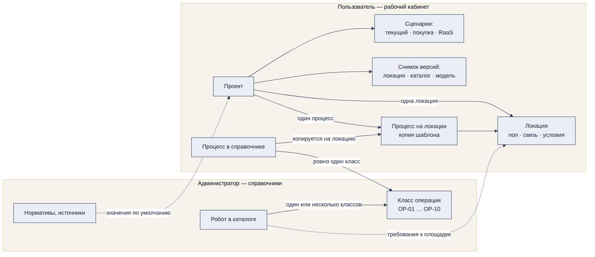
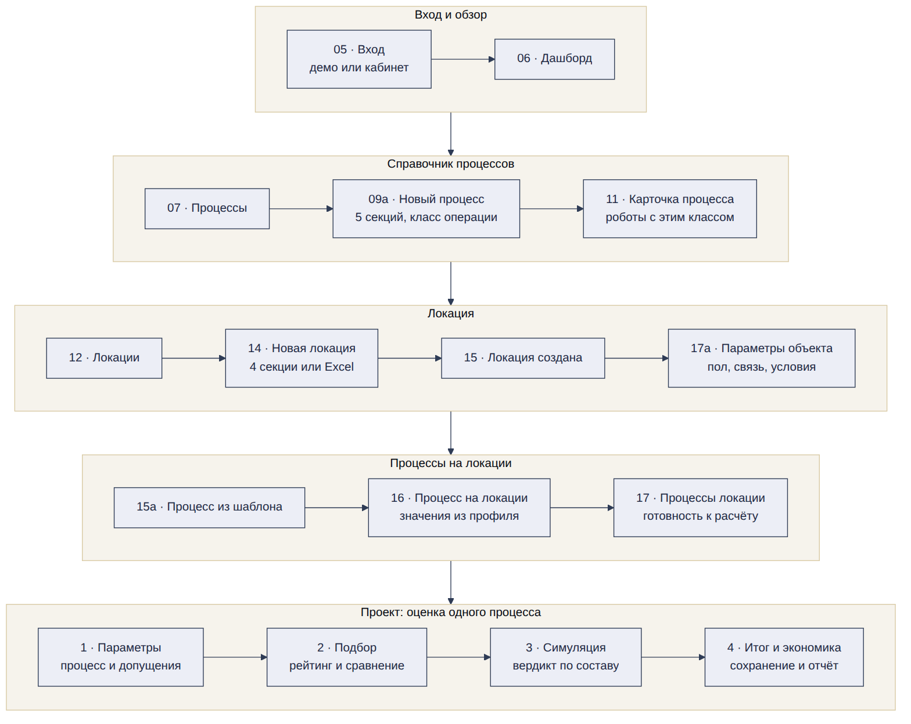
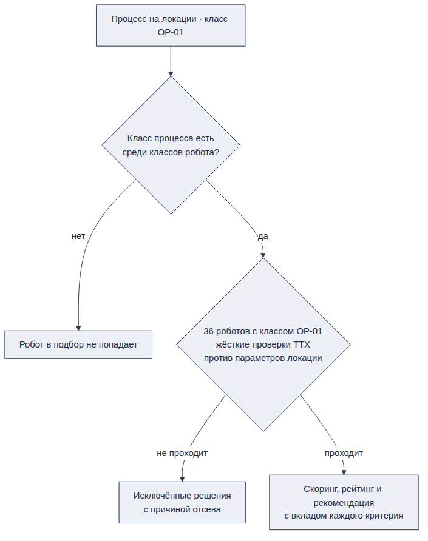

# 3. Порядок работы и модель сущностей

Работа на платформе идёт в два контура. Администратор заранее наполняет каталог роботов и справочник классов операций. Пользователь заводит процессы, затем локацию, добавляет процессы в локацию и создаёт из неё проект, в котором считаются подбор, экономика и имитация.

> **Предусловие.** Каталог роботов, классы операций и нормативы загружены администратором до первого входа пользователя. Пользователь роботов не заводит \[ТЗ 3.1.4, 4.2.7\]. Как наполняется каталог — раздел 6.

## 3.1. Три шага пользователя до расчёта

1.  **Процессы** — что хотим автоматизировать. Процесс хранится в библиотеке пользователя и используется в разных локациях (раздел 9).

2.  **Локация** — тип объекта и его параметры (раздел 10).

3.  **Процессы в локации** — процесс из библиотеки плюс данные площадки: объём, исполнители, зарплата, доля ручной работы (раздел 10.4).

**Почему процессы первыми — решение команды**

- Процесс определяет, какие роботы подходят. Локация без процессов подбора не даёт.

- Один процесс повторяется на многих площадках. Сеть из пяти одинаковых РЦ заводит «Перемещение паллет» один раз и добавляет его в каждую локацию.

- Пользователь начинает с понятного вопроса «что автоматизировать», а не с заполнения 42 параметров объекта \[ДС-Склад\].

**Отличие от ТЗ.** В ТЗ путь начинается с выбора отрасли и объекта \[ТЗ 2.2, шаг 1\]. Этот вход сохраняется: локацию можно создать первой, но платформа подскажет «Добавьте процессы — без них подбора не будет». Обоснование порядка идёт в материалы для жюри — там оценивают подход к MVP \[ТЗ 9\].

**Гость.** В демо-локациях организатора процессы уже есть, поэтому гость сразу видит подбор и расчёт. Его данные не сохраняются \[ТЗ 2.1.1, 3.1.2\].

## 3.2. Модель сущностей

*Модель сущностей RAV5. Стрелка читается как «ссылается на». Робот и процесс встречаются в классе операции, локация даёт значения, с которыми сверяются ТТХ и требования робота к площадке. В проекте — одна локация и один процесс.*

| **Сущность** | **Кто заводит** | **Что внутри** | **Пример** |
|----|----|----|----|
| Робот | Администратор | Карточка каталога: ТТХ, цена, статус; операции робота с производительностью в час | DMR Carrier P · перемещение паллет, 40–60 паллет/ч \[Прим.\] |
| Класс операции | Администратор | Код OP-NN, название, описание «что делает процесс», единица измерения, типовые носители, примеры процессов. У процесса один класс, у робота несколько | OP-01 · Перемещение грузов |
| Процесс в библиотеке | Пользователь; у гостя — демо | Название, класс операции, описание, где применяется, точки маршрута | Перемещение паллет между зонами |
| Локация | Пользователь; у гостя — демо | Тип объекта и параметры: площадь, режим, персонал, проходы, пол, связь, условия эксплуатации | РЦ Химки: склад, 20 000 м², 180 сотрудников, 2 смены по 11 ч \[ДС-Склад, Экран «Локация — процессы»\] |
| Процесс в локации | Пользователь | Объём, исполнители, зарплата, доля для роботизации, груз, маршрут, текущая производительность; режим берётся из локации | 2 000 паллет/сут, 25 операторов по 120 000 руб. \[ДС-Склад\] |
| Проект | Пользователь | Локация, один процесс, три сценария (текущий · покупка · RaaS), выбранное решение и состав, версии данных и модели | Роботизация паллетного потока · РЦ Химки \[Экран «Дашборд», ТЗ 3.1.5, 3.5.5\] |

## 3.3. Сквозной путь

*Сквозной путь пользователя. Номера — экраны из реестра; шаги оценки — подразделы 11.2–11.5.*

**Как путь RAV5 закрывает путь ТЗ \[ТЗ 2.2\]**

| **Шаг ТЗ** | **Раздел RAV5** | **Что меняется** |
|----|----|----|
| 1\. Выбор отрасли и объекта | 10\. Локации | Тип объекта выбирается при создании локации; для склада, аэропорта и медучреждения есть демо-наборы \[ТЗ 5.5\] |
| 2\. Формирование параметров проекта | 9, 10, 11.1 | Параметры разнесены: что делаем — в процессе, условия площадки — в локации, объём и люди — в процессе локации. Ручной ввод и загрузка файла сохраняются \[ТЗ 3.2.2, 3.2.3\]. Создание проекта в ТЗ входит в этот шаг \[ТЗ 2.1.2\], в RAV5 это раздел 11.1; процесс выбирается на шаге 1 проекта |
| 3\. Подбор решений | 11.3 | Подбор по одному процессу проекта; ранжируются пары «решение + способ приобретения» |
| 4\. Сравнение | 11.3, 7.6 | Сравнение 2–4 вариантов и таблица «текущий · покупка · RaaS» на подборе; в каталоге — экран сравнения |
| 5\. Расчёт экономики | 11.3, 11.5 | Предварительно — на подборе, итог — после симуляции на проверенном составе |
| 6\. What-if анализ | 11.3, 11.5 | Панель «Параметры расчёта» с семью допущениями ТЗ 3.5.3 на подборе; чувствительность ±20 % на итоге |
| 7\. Визуализация | 11.4 | Симуляция идёт до итоговой экономики: итог считается на проверенном составе |
| 8\. Сохранение и экспорт | 11.6 | — |

**Что обязательно пройти на демо \[ТЗ 5.4\]**

- Полный сценарий на одном из наборов организатора: создать проект, подобрать решения, сравнить сценарии, показать расчёт, запустить визуализацию.

- Результаты из презентации должны воспроизводиться в переданной версии продукта \[ТЗ 5.6\].

- К промежуточной сдаче путь должен работать минимум до подбора и предварительного расчёта \[ТЗ 8.1.4\].

## 3.4. Как робот встречается с процессом

*Логика подбора: совпадение класса операции, затем жёсткие проверки ТТХ против параметров локации, затем скоринг.*

- **Ключ подбора — класс операции.** У процесса ровно один класс, у робота — один или несколько. Робот участвует в подборе по процессу только тогда, когда класс процесса есть среди классов робота. На экране справочника это написано подписью: «10 классов. У процесса один класс, у робота — один или несколько: по совпадению класса система подбирает роботов» \[Экран А8\].

- **У класса есть код.** Классы ведёт администратор, коды сквозные: OP-01 … OP-10 (раздел 6.7). Код виден в карточке процесса, в карточке робота и в колонке «Классы операций» каталога \[Экран А8, А1, А2, 11\].

- **Поле в процессе** называется «Класс операции — ID привязки к роботам», значение — «OP-01 · Перемещение грузов», подсказка: «Класс задан процессом из справочника и не меняется» \[Экран 09а, 16\].

- **Поле в роботе** называется «Классы операций — ID привязки к процессам», отмечается несколько значений, подсказка блока: «Классы операций — ключ подбора: процесс с одним из этих классов увидит робота в списке подходящих решений» \[Экран А2\].

- **Жёсткие проверки.** ТТХ робота сверяются с параметрами процесса и локации: класс операции, способ обработки груза, грузоподъёмность — с массой единицы груза, ширина робота плюс запас — с минимальной шириной прохода, среда и температура — с условиями эксплуатации, наличие цены. Запас по ширине в прототипе 0,5 м, в форме процесса 0,6 м — нужен один норматив (расхождение 128) \[Экран 09а, А2, 16, Прототип\].

- **Пол и связь — проверка, а не фильтр.** Покрытие и ровность пола, допустимая нагрузка, пороги и уклоны, Wi-Fi в зоне работы и мощность для зарядки сверяются с требованиями робота на вкладке «Инфраструктура» карточки решения. При несоответствии или «нет данных» решение остаётся в рейтинге с пометкой «требует проверки», условие уходит в реестр итога. Правила — раздел 10.5.

- **Скоринг** ранжирует оставшихся роботов и показывает вклад факторов \[ТЗ 3.4.5\]. Веса по умолчанию — раздел 11.3.

- **Ручное добавление** робота вне подборки разрешено, с предупреждением \[ТЗ 3.4.4\].

Что пользователь видит до расчёта \[Экран 11\]

Карточка процесса показывает результат совпадения по классу ещё до создания проекта: блок «Роботы с классом OP-01 · совпадение по классу операции», счётчик «36 роботов» и разбивка по качеству данных.

| **Значение на экране** | **Сколько** | **Что значит** |
|----|----|----|
| **Класс совпадает, ТТХ подтверждены** | 24 | Робот проходит в подбор, ТТХ можно проверять жёсткими фильтрами |
| **Класс совпадает, есть ограничения** | 10 | ТТХ подтверждены частично: часть проверок пройдёт на допущениях |
| **Недостаточно данных** | 2 | Ключевых ТТХ нет, робот попадёт в «исключённые» с причиной |

> **Счётчик «36 роботов» на карточке процесса — это совпадение по классу, а не результат подбора. Жёсткие проверки применяются уже в проекте, на конкретной локации, и число кандидатов там будет меньше \[Экран 11, раздел 11.3\].**

Что закрывают чистовые макеты

- **Правка шаблона не меняет локации.** Процесс добавляется на локацию копией: «Копия шаблона привяжется к РЦ Химки: значения настроите под эту локацию, справочник не изменится» \[Экран 15а\]. Удаление тоже локальное: «Процесс удалится только с этой локации. Шаблон в разделе „Процессы“ и другие локации не изменятся» \[Экран 17в\].

- **Один процесс работает на локациях разных типов.** У процесса есть отрасли — у «Перемещения паллет» это «Склад, Производство, Распределительный центр», — и счётчик «Локаций, где подходит — 3» \[Экран 11, 09а\]. Справочник процессов общий: в нём рядом живут складские, аэропортовые и больничные процессы (раздел 9.1).

Открыто

- Какие шаги к финалу реализованы полностью, частично или как прототип — жюри требует указать это отдельно \[ТЗ 5.7\].

- Что происходит с локацией, если администратор скрыл класс операции, на который ссылается процесс этой локации.
