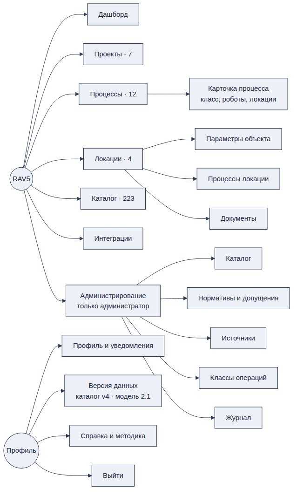

# 5. Навигация и личный кабинет

Платформа устроена как рабочий кабинет с постоянным левым меню. Меню одинаковое на всех экранах, у администратора в нём есть дополнительный пункт «Администрирование» \[Экран «Дашборд», Экран А1\].

*Карта разделов платформы. Порядок веток — как в меню.*

## 5.1. Левое меню

| **Элемент** | **Что на экране** | **Кто видит** | **Куда ведёт** | **Статус** |
|----|----|----|----|----|
| Логотип «RAV5 · оценка роботизации» | Название продукта | Все | — | Макет |
| «Новый проект» с кнопкой «+» | Быстрое создание проекта | Зарегистрированный пользователь, администратор | Раздел 11.1 | Макет |
| Дашборд | Сводка по проектам и локациям | Все | Раздел 8 | Макет |
| Проекты · счётчик 7 | Список проектов оценки | Зарегистрированный пользователь, администратор | Раздел 11 | Макет |
| Процессы · счётчик 12 | Библиотека процессов | Зарегистрированный пользователь, администратор | Раздел 9 | Макет |
| Локации · счётчик 4 | Список локаций | Зарегистрированный пользователь, администратор | Раздел 10 | Макет |
| Каталог · счётчик 223 | Каталог решений | Все, включая гостя \[ТЗ 3.1.2\] | Раздел 7 | Макет |
| Интеграции | Подключения к внешним системам | Зарегистрированный пользователь, администратор | Раздел 12 | Макет |
| Администрирование | Управление каталогом, нормативами, источниками | Только администратор \[ТЗ 4.4.1\] | Раздел 6 | Макет |
| Блок пользователя внизу | Инициалы, имя, роль: «рабочий кабинет» у пользователя, «администратор · каталог и нормативы» у админа | Все, кроме гостя | Меню кабинета | Макет |

- Счётчик у пункта — число записей, доступных этому пользователю. У гостя счётчики показывают демо-данные организатора. Предложение.

- Счётчик «Каталог 223» совпадает с числом строк в файле организатора \[Кат-CSV\]. Уникальных продуктов в файле 187 — счётчик нужно считать по уникальным позициям после импорта. Предложение.

## 5.2. Меню личного кабинета

Меню открывается по клику на блок пользователя \[Экран «Дашборд»\].

| **Пункт** | **Что показывает** | **Зачем** | **Статус** |
|----|----|----|----|
| Имя, e-mail, организация | «И. Демидов · demo@rav5.ru · Демо-организация» | Кто вошёл и в какой организации | Макет |
| Профиль и уведомления | Данные пользователя и настройки уведомлений | Смена имени, пароля, подписок | Макет; экран ждёт макета |
| Версия данных | «ФЦ БАС · каталог v4 · модель 2.1» | Какие версии каталога и расчётной модели сейчас действуют. Нужно для воспроизводимости расчёта \[ТЗ 3.1.5\] | Макет |
| Справка и методика | Руководство и описание формул | Формулы, единицы, источники и допущения должны быть доступны в интерфейсе или в отчёте \[ТЗ 3.5.8\]; руководство пользователя — часть сдачи \[ТЗ 6.7\] | Макет; экран ждёт макета |
| Выйти | Завершение сессии | — | Макет |

## 5.3. Роли и видимость разделов

| **Раздел** | **Гость** | **Пользователь** | **Администратор** | **Основание** |
|----|----|----|----|----|
| Каталог | Просмотр | Просмотр, сравнение | Просмотр, сравнение | \[ТЗ 2.1.1, 3.1.2\] |
| Дашборд | Демо-данные | Свои данные | Свои данные | \[ТЗ 3.1.2, 4.4.3\] |
| Процессы, Локации, Проекты | Демо без сохранения | Создание, правка, копирование, удаление | То же | \[ТЗ 3.1.3\] |
| Интеграции | Нет | Да | Да | Предложение |
| Администрирование | Нет | Нет | Да | \[ТЗ 3.1.4, 4.4.1\] |

**Меню гостя.** На экранах подбора и экономики у гостя другое меню: «Открыть демо-проект +», «Демо-проекты · 3», «Процессы · 12», «Каталог · 223»; внизу — «Гость · демо-данные · без сохранения»; в шапке проекта — плашка «Демо-режим · изменения не сохраняются» \[Экраны «12 · Подбор», «14 · Экономика»\].

**Открыто**

- Экраны «Профиль и уведомления» и «Справка и методика».

- Что видит гость на месте пунктов, которые ему недоступны: пункт скрыт или показан с предложением зарегистрироваться.
