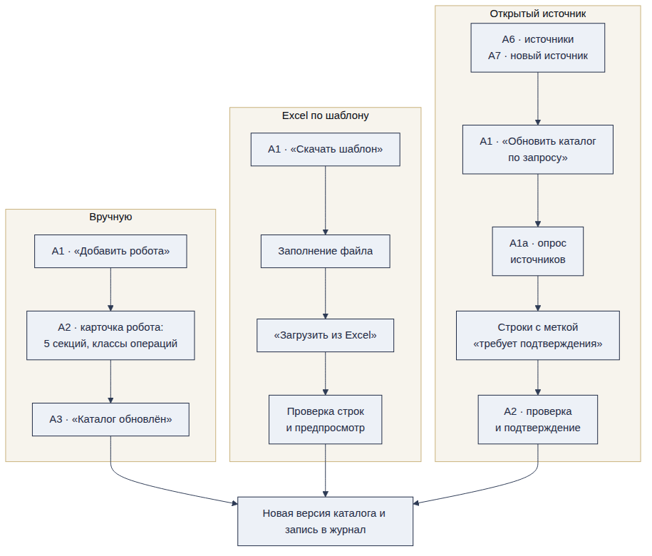
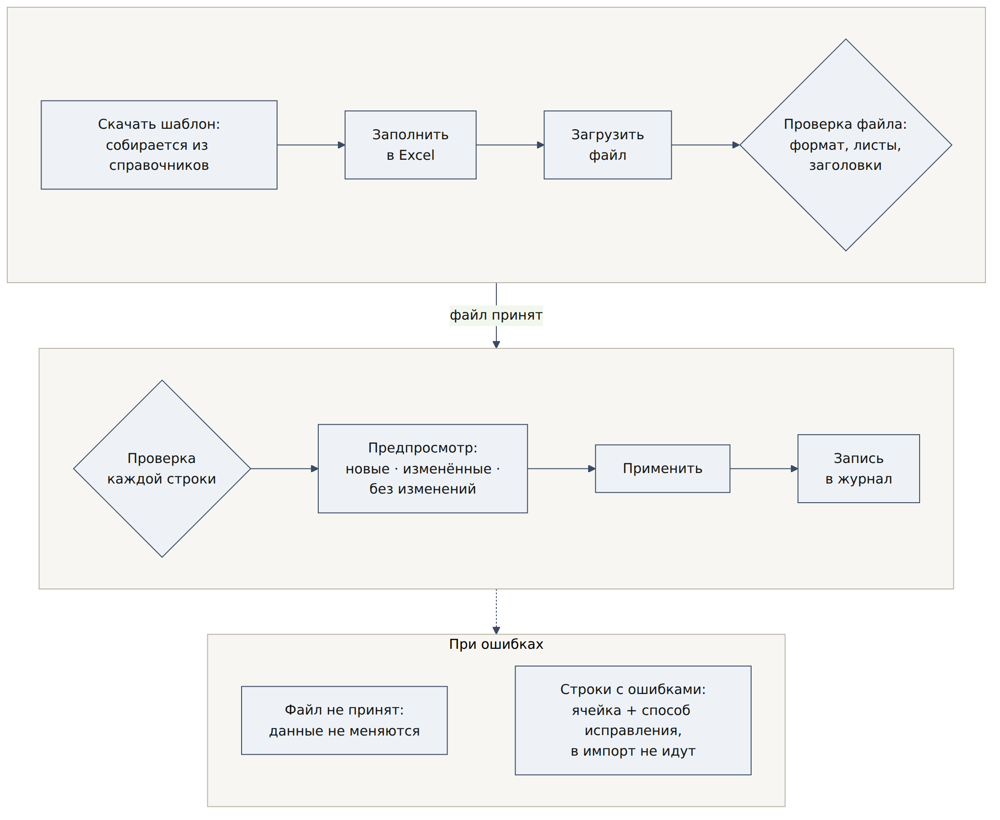
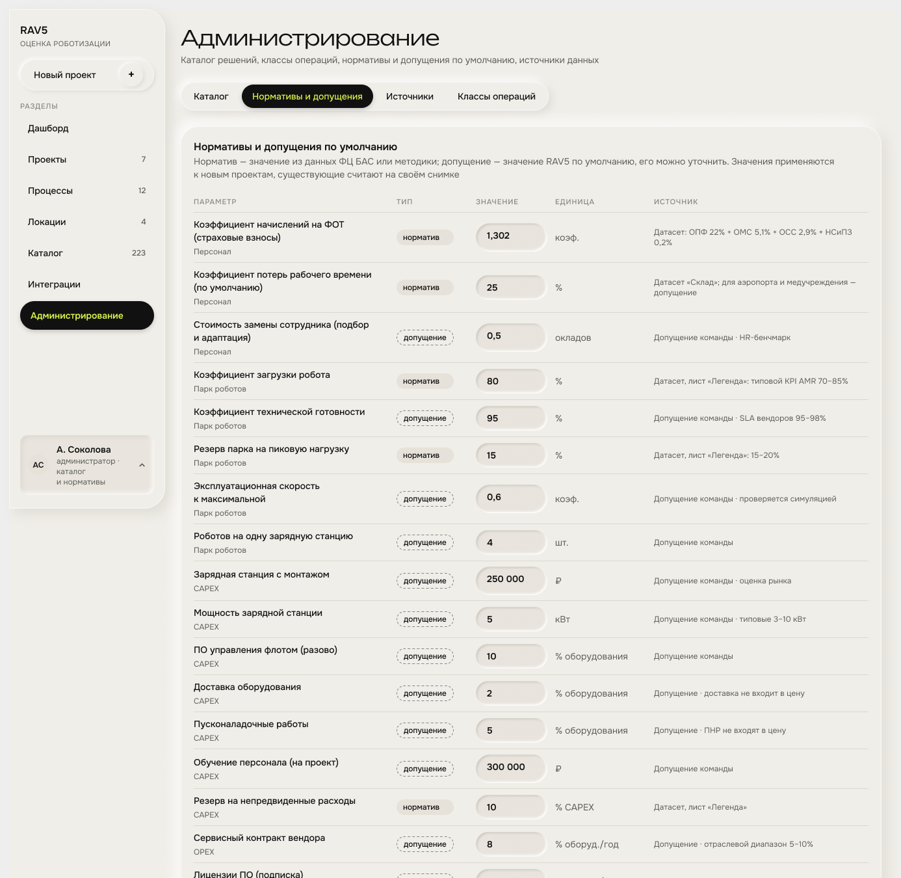
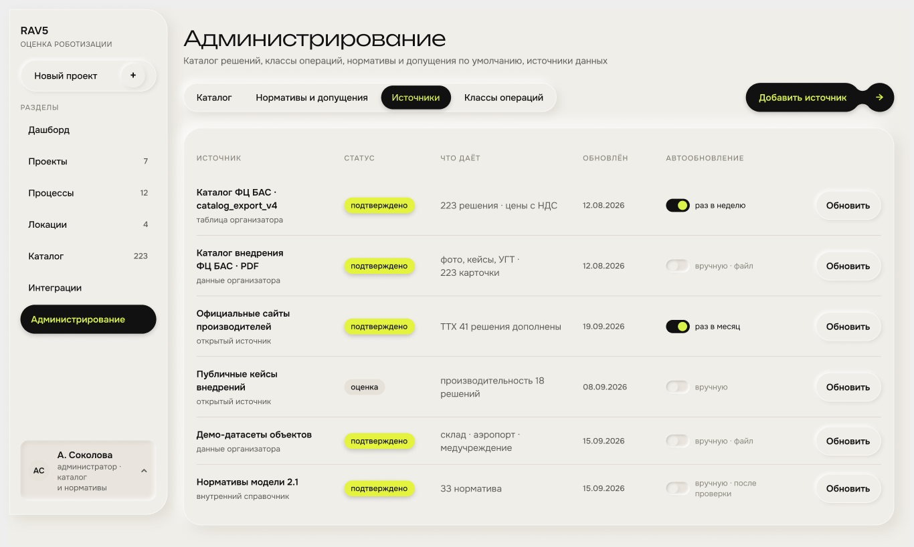
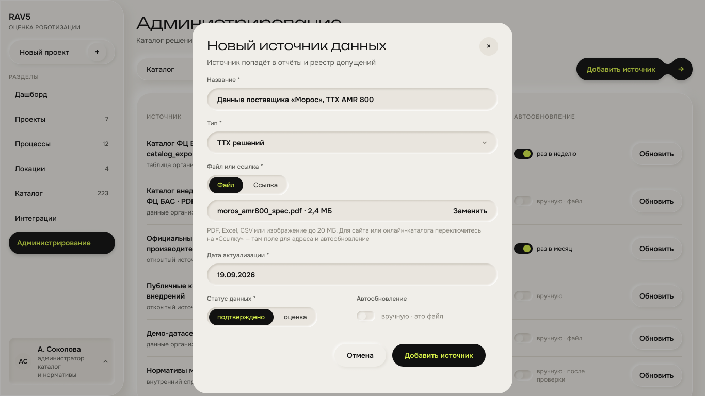

# 6. Администрирование

С этого раздела начинается работа платформы: пока администратор не наполнил каталог и справочник классов операций, пользователю нечего подбирать. Администратор ведёт всё, на чём держится оценка: каталог роботов, классы операций, нормативы по умолчанию, источники данных. Каждое изменение пишется в журнал с автором и датой и создаёт новую версию данных; сохранённые проекты считаются на своей версии \[ТЗ 2.1.6, 3.1.4, 3.1.5, Экран А1\].

**Кто видит раздел.** Только роль «Администратор». У остальных ролей пункт меню скрыт \[ТЗ 4.4.1\]. На макете администратор — «А. Соколова · администратор · каталог и нормативы» \[Экран А1\].

Вкладки раздела

| **Вкладка** | **Экраны** | **Что делает администратор** | **Статус** |
|----|----|----|----|
| **Каталог** | А1 список · А1а обновление по запросу · А2 карточка робота · А3 подтверждение | Добавляет и правит роботов, загружает Excel, запускает опрос источников | Макет |
| **Нормативы и допущения** | А5 | Правит значения по умолчанию для расчёта | Макет |
| **Источники** | А6 реестр · А7 файл · А7б ссылка | Регистрирует, откуда взяты данные, запускает обновление | Макет |
| **Классы операций** | А8 список · А10 новый класс | Ведёт справочник ключей подбора | Макет |
| **Журнал** | Журнал | Смотрит, кто, что и когда изменил | Макет; сверх требований ТЗ |

Кнопка «Обновить каталог по запросу» стоит в шапке вкладки «Каталог» и переводит экран в состояние опроса источников А1а \[ТЗ 3.3.6, Экран А1, А1а\].

## 6.1. Как робот попадает в каталог

Три пути наполнения каталога. Все заканчиваются новой версией каталога и записью в журнал.

| **Способ** | **Путь по экранам** | **Когда использовать** | **Статус** |
|----|----|----|----|
| **Вручную** | А1 «Добавить робота» → А2 карточка → «Сохранить робота» → А3 «Каталог обновлён» | Одна позиция или точечная правка | Макет |
| **Excel по шаблону** | А1 «Скачать шаблон» → заполнить → А2 «Загрузить из Excel» → проверка строк и предпросмотр | Много позиций, разметка классов операций пачкой | Макет; шаблон — раздел 6.4 |
| **Файл организатора** | А1 «Обновить каталог по запросу» → А1а опрос источников → А4 предпросмотр изменений | Пришла новая выгрузка ФЦ БАС \[Доп. 6\] | Макет; маппинг — раздел 6.5 |
| **Из открытого источника** | А6 или А7/А7б «Добавить источник» → А1 «Обновить каталог по запросу» → А1а → строки с меткой «требует подтверждения» → А2 «Подтвердить данные» | Нужно дополнить каталог данными с сайтов производителей | Предложение; автопарсинг — преимущество, но не обязателен \[ТЗ 9\] |

**Импорт из открытого источника — предложение**

Отдельного экрана нет: результаты парсинга попадают в тот же список решений А1.

- Администратор добавляет ссылку на источник или нажимает «Обновить каталог по запросу».

- Парсер собирает решения и кладёт их в список А1 как обычные строки с меткой «новый».

- Решение с меткой «новый» в подбор не попадает.

- Администратор открывает карточку А2, проверяет поля и нажимает «Подтвердить» — метка снимается, решение работает как остальные.

- Если решение уже есть в каталоге, новая строка не создаётся: изменения идут на А4, где видно «было → стало» и сколько проектов затронет.

- У каждого поля, заполненного парсером, остаются источник и дата \[ТЗ 3.3.4\]. Если значение извлечено автоматически и не проверено человеком, статус источника — «оценка», как на А7.

- На демонстрации парсер не должен быть единственной точкой отказа: результат прогона загружается заранее \[ТЗ 4.2.7\].

**Главное правило: у робота должен быть класс операции — решение команды**

- Класс операции — ключ, по которому робот встречается с процессом (раздел 3.4).

- У робота может быть несколько классов, у каждого своя производительность в час. Пример: DMR Carrier P перемещает паллеты по полу и ставит их на ярус — это два класса с разной производительностью \[Прим.\].

- Робот без класса остаётся в каталоге и виден пользователю, но в подбор не попадает. В А1 он помечается «нет класса операции». Предложение.

- При импорте файла организатора класс подсказывается по полям «Сценарий» и «Подтип», если соответствие однозначное (раздел 6.5). Остальное размечает администратор.

## 6.2. А1 · Каталог решений

Вкладка «Каталог» — первый экран администрирования. Отсюда каталог пополняется тремя способами: вручную, файлом Excel и опросом источников.

Вкладки раздела: «Каталог» · «Нормативы и допущения» · «Источники» · «Классы операций» · «Журнал». Подзаголовок раздела: «Каталог решений, классы операций, нормативы и допущения по умолчанию, источники данных» \[Экран А1, А8\].

Элементы экрана

| **Элемент** | **Что делает** | **Статус** |
|----|----|----|
| **Поиск «Найти решение или производителя»** | Поиск по названию и производителю | Макет |
| **«Обновить каталог по запросу»** | Запускает опрос источников, экран переходит в состояние загрузки А1а | Макет |
| **«Добавить робота +»** | Открывает пустую карточку робота А2 | Макет |
| **Таблица решений** | Шесть колонок, строка кликабельна стрелкой «→» в карточку | Макет |
| **Подпись «Показаны 12 из 223 решений»** | Счётчик выдачи и полного объёма каталога | Макет |

Колонки таблицы

| **Колонка** | **Содержание** | **Пример с экрана** | **Статус** |
|----|----|----|----|
| **РЕШЕНИЕ** | Название, под ним производитель и тип решения. У части строк рядом с названием метка «требует подтверждения» | DMR 600 · требует подтверждения · ООО «Диком-Сервис» · Мобильные роботы | Макет |
| **КЛАССЫ ОПЕРАЦИЙ** | Коды классов робота плашками, один или несколько | OP-01 · OP-08 | Макет |
| **ГРУЗОПОДЪЁМНОСТЬ** | Верхняя граница из ТТХ | до 1 500 кг | Макет |
| **ЦЕНА** | Цена с НДС в миллионах рублей | 2,70 млн ₽ | Макет |
| **ОБНОВЛЕНО** | Дата последнего изменения карточки; у только что добавленного решения — «сейчас» | 12.08.2026 · 19.09.2026 · сейчас | Макет |
| **ПОЛНОТА ТТХ** | Доля заполненных ТТХ в процентах | 50% · 63% · 90% | Макет |

Двенадцать решений на экране А1

| **Решение** | **Производитель** | **Классы** | **Грузоподъёмность** | **Цена, млн ₽** | **Обновлено** | **Полнота ТТХ** |
|----|----|----|----|----|----|----|
| **DMR 600 · требует подтверждения** | ООО «Диком-Сервис» | OP-01 | до 600 кг | 3,75 | 12.08.2026 | 50% |
| **Сёмабот · требует подтверждения** | ООО «Семаргл» | OP-01, OP-04 | до 1 500 кг | 2,50 | 12.08.2026 | 50% |
| **Ronavi H1500** | ООО «Ронави Роботикс» | OP-01 | до 1 500 кг | 2,70 | 12.08.2026 | 50% |
| **Ronavi SR** | ООО «Ронави Роботикс» | OP-03 | до 50 кг | 0,95 | 12.08.2026 | 50% |
| **Ronavi H2000** | ООО «Ронави Роботикс» | OP-01 | до 2 000 кг | 2,64 | 12.08.2026 | 50% |
| **Ronavi SD** | ООО «Ронави Роботикс» | OP-08 | до 10 кг | 1,40 | 12.08.2026 | 50% |
| **Ronavi M** | ООО «Ронави Роботикс» | OP-01, OP-08 | до 1 200 кг | 2,40 | 12.08.2026 | 50% |
| **Ronavi RCM** | ООО «Ронави Роботикс» | OP-01 | до 350 кг | 2,00 | 12.08.2026 | 50% |
| **AMR 100** | ООО «Морос» | OP-01, OP-08 | до 100 кг | 1,50 | 12.08.2026 | 63% |
| **AMR 800** | ООО «Морос» | OP-01, OP-08 | до 800 кг | 1,80 | 19.09.2026 | 90% |
| **AMR 1500** | ООО «Морос» | OP-01 | до 1 500 кг | 2,20 | 12.08.2026 | 50% |
| **DMR 1200** | ООО «Диком-Сервис» | OP-01 | до 1 200 кг | 4,00 | 12.08.2026 | 50% |

> **Сверка с файлом организатора: все двенадцать цен экрана совпадают с полем «Цена изделия» в \[Кат-CSV\] до рубля — 3 750 000, 2 500 000, 2 700 000, 950 000, 2 640 000, 1 400 000, 2 400 000, 2 000 000, 1 500 000, 1 800 000, 2 200 000 и 4 000 000 ₽. Грузоподъёмности тоже совпадают: в файле они зашиты в название позиции, например «Ronavi H2000 (грузоподъемность до 2 000 кг)».**

Экран А1а · обновление каталога по запросу

Нажатие «Обновить каталог по запросу» переводит экран в состояние загрузки: кнопка меняется на «Обновляем каталог…», таблица пустеет, вместо строк — подпись «Загружаем каталог — таблица обновится, когда источники ответят» \[Экран А1а\].

| **Элемент состояния** | **Текст на экране** | **Что показывает** |
|----|----|----|
| **Заголовок прогресса** | «Опрашиваем источники · 2 из 3» | Сколько источников уже ответили |
| **Строка источников** | «ФЦ БАС · catalog_export_v5.csv — получено 12 позиций · Ронави Роботикс — ждём ответа · Реестр Минпромторга — в очереди» | Статус по каждому источнику отдельно: получено, ждём, в очереди |
| **Кнопка** | «Обновляем каталог…» | Повторный запуск заблокирован до конца опроса |

- Опрос идёт по источникам с включённым автообновлением из реестра А6 (раздел 6.9); «Реестр Минпромторга» на экране А1а в реестре А6 отсутствует — источник нужно завести или убрать из опроса.

- Строки, пришедшие из источника, попадают в таблицу с меткой «требует подтверждения» и в подбор не идут, пока администратор не откроет карточку и не подтвердит данные (раздел 6.1).

- Опрос не должен быть единственной точкой отказа на демонстрации: результат прогона загружается заранее \[ТЗ 4.2.7\].

Экран А3 · робот добавлен

После сохранения карточки администратор возвращается в каталог: сверху зелёная плашка «✓ Каталог обновлён» с кнопкой «Открыть в каталоге», строка нового решения стоит в таблице со значением «сейчас» в колонке «Обновлено» \[Экран А3\].

> **На макете А1 решение AMR 800 уже показано с датой 19.09.2026 и полнотой 90%, то есть А1 — состояние после добавления, а А3 показывает тот же список ещё раз. Для демонстрации достаточно одного из двух состояний; в PRD А1 описан как обычный список, А3 — как подтверждение операции.**

Что добавить на экран — предложение

- Фильтры «требует подтверждения», «без классов операций» и «полнота ниже 70%»: это три главные очереди работы администратора, сейчас их видно только глазами.

- Колонку «Статус» (в эксплуатации · пилот · НИОКР) и «УГТ»: обе величины есть в карточке и в файле организатора, а в списке их нет, хотя именно по ним отбираются решения для демонстрации \[Кат-CSV\].

- Правило для метки «требует подтверждения». На макете её получили DMR 600 и Сёмабот, при этом Ronavi RCM со статусом «rnd» и УГТ 3 по данным организатора метки не имеет \[Кат-CSV\]. Предположение команды: метку даёт поле «ТТХ подтверждены = Нет» из карточки (раздел 6.3), но связь нужно зафиксировать.

## 6.3. А2 · Карточка робота

Карточка — единственное место, где задаются данные робота, от которых зависит подбор. Пять секций: основное и цена, классы операций и идентификатор, технические параметры, условия применения, фотографии.

Шапка экрана: ссылка «← Администрирование · Каталог решений» слева и плашка автосохранения «Черновик сохранён · 14:18» справа. Заголовок «Новый робот», подзаголовок: «Карточка робота для каталога и подбора. После сохранения робот появится в „Каталоге“ и будет предлагаться процессам с его классами операций» \[Экран А2\].

Секция 1 · Основное и цена

| **Поле** | **Значение на экране** | **Тип и формат** | **Обяз.** | **Зачем поле** | **Статус** |
|----|----|----|----|----|----|
| **Название** | AMR 800 | Текст | Да | Подпись решения в каталоге, подборе и отчёте \[ТЗ 3.3\] | Макет |
| **Производитель** | ООО «Морос» | Текст | Да | Каталог, отчёт, фильтр по производителю \[ТЗ 3.3\] | Макет |
| **Статус** | В эксплуатации | Список: В эксплуатации · пилот · НИОКР | Да | Зрелость решения; соответствует полю «статус» файла организатора (operation · piloting · rnd) \[Кат-CSV\] | Макет |
| **УГТ** | 9 | Целое 1–9, подсказка «Уровень готовности технологии, 1–9» | Да | Скоринг и отбор решений для демонстрации \[Кат-CSV\] | Макет |
| **Цена с НДС** | 1 800 000 ₽, подсказка «без доставки, ПНР и интеграции» | Число, ₽ | Да | CAPEX оборудования; доставка, ПНР и интеграция считаются от неё нормативами (раздел 6.8) \[Доп. 6\] | Макет |
| **Тип решения** | Мобильный робот · AMR | Список типов решений | Да | Группировка каталога, фильтр «Тип решения» \[Доп. 3.2\] | Макет |

Секция 2 · Классы операций и идентификатор

Подсказка секции: «Классы операций — ключ подбора: процесс с одним из этих классов увидит робота в списке подходящих решений» \[Экран А2\].

| **Поле** | **Значение на экране** | **Тип** | **Обяз.** | **Правило** | **Статус** |
|----|----|----|----|----|----|
| **Уникальный идентификатор** | RB-0224 | Текст, формат RB-NNNN | Да | «Присваивается при создании и не меняется. По нему робот связан с проектами, расчётами и обновлениями каталога». Ключ обновления при повторной загрузке файла | Макет |
| **Классы операций — ID привязки к процессам** | Отмечены OP-01 «Перемещение грузов» и OP-08 «Адресная доставка» | Набор плашек со всеми десятью классами справочника, можно выбрать несколько | Да | Робот попадает в подбор по процессу, если класс процесса есть среди отмеченных (раздел 3.4, 6.7) | Макет |

Плашки показывают код, название и короткую подсказку класса: «OP-01 · Перемещение грузов — паллеты, тележки, короба», «OP-02 · Комплектация заказов — отбор по строкам», «OP-03 · Сортировка — по направлениям», «OP-04 · Хранение и выдача — стеллажи, АСХ», «OP-05 · Упаковка и паллетирование — линии, паллетайзеры», «OP-06 · Инвентаризация — пересчёт и контроль», «OP-07 · Уборка помещений — сухая и влажная», «OP-08 · Адресная доставка — по точкам маршрута», «OP-09 · Охрана и патрулирование — обходы, видео», «OP-10 · Мониторинг и инспекция — датчики, осмотр» \[Экран А2\].

Под плашками — расчётная подсказка: «Отмечено 2 класса. Робот попадёт в подбор для 5 процессов справочника: перемещение паллет и багажа, доставка питания, белья и биоматериалов» \[Экран А2\]. Это прямая проверка связи «робот → процессы»: администратор видит последствия отметки до сохранения.

> **Подсказка сверяется со справочником процессов: у OP-01 два процесса (перемещение паллет, перемещение багажа), у OP-08 — четыре (бортпитание, питание по отделениям, бельё, биоматериалы). Итого шесть, а подсказка говорит «5 процессов» и перечисляет пять. Расхождение — раздел 15.**

Секция 3 · Технические параметры

Подсказка секции: «Если точного значения нет, укажите ориентировочное — оно войдёт в расчёт как допущение». У части полей стоит плашка «точное значение» \[Экран А2\].

| **Поле** | **Значение на экране** | **Ед.** | **Плашка «точное значение»** | **Для чего используется** | **Статус** |
|----|----|----|----|----|----|
| **Грузоподъёмность** | 800 | кг | Да | Жёсткая проверка: не меньше массы единицы груза процесса, если груз неделимый (раздел 3.4) | Макет |
| **Макс. скорость** | 2 | м/с | Нет | Время цикла и имитация; на объекте ограничивается лимитом процесса 1,5 м/с (раздел 9.2) | Макет |
| **Автономность** | 24 | ч | Нет | Число смен без зарядки, размер парка | Макет |
| **Зарядка** | 60 | мин | Нет | Доля времени вне работы, количество зарядных станций | Макет |
| **Длина × ширина × высота** | 940 × 640 × 230 | мм | Да | Жёсткая проверка ширины: ширина робота плюс запас 0,6 м не больше ширины прохода | Макет |
| **Мин. температура** | 5 | °C | Да | Жёсткая проверка среды: холодные зоны и улица | Макет |
| **Средняя мощность** | 1 | кВт | Нет | Потребление электроэнергии в OPEX | Макет |
| **Загрузка / разгрузка** | 45 / 45 | с | Нет | Время цикла рейса вместе с дистанцией и скоростью | Макет |

Секция 4 · Условия применения

Подсказка секции: «Ограничения, по которым робот отсеивается ещё до рейтинга: как берёт груз и где может работать» \[Экран А2\].

| **Поле** | **Значение на экране** | **Допустимые значения** | **Для чего используется** | **Статус** |
|----|----|----|----|----|
| **Способ обработки груза** | Платформа | Платформа · вилы · буксировка · кузов · щётки | Сверяется с полем процесса «Допустимые способы обработки груза»; от способа зависит коэффициент замещения труда (раздел 9.2) | Макет |
| **Допуск в помещения** | Да | Да · Нет | Жёсткая проверка против поля процесса «Работа внутри помещений» | Макет |
| **Работа на улице** | Нет | Да · Нет | Жёсткая проверка для перронов, территорий и уличных маршрутов | Макет |
| **ТТХ подтверждены** | Частично | Да · Частично · Нет | Качество данных решения; карточка процесса делит роботов на «ТТХ подтверждены», «есть ограничения» и «недостаточно данных» (раздел 3.4) | Макет |
| **Источник ТТХ** | по аналогу AMR 1500, описание каталога | Текст | Откуда взяты значения; попадает в реестр допущений отчёта \[ТЗ 3.3.4\] | Макет |

Секция 5 · Фотографии

Подсказка секции: «Первое фото станет обложкой карточки. Минимум одно фото — без него робота не сохранить» \[Экран А2\].

- Загруженное фото показано плиткой с плашкой «обложка» и именем файла «amr800_front.jpg».

- Рядом зона перетаскивания: «Перетащите фото сюда», «или выберите файлы на компьютере · загружено 1 из 8», предупреждение «Без фото кнопка „Сохранить робота“ недоступна» и кнопка «Выбрать файлы».

- Ограничение — 8 файлов на карточку. Форматы и предельный размер на экране не указаны; в форме источника данных действует правило «PDF, Excel, CSV или изображение до 20 МБ» \[Экран А7\], его же предлагается применить к фото. Предложение.

Правая панель · готовность карточки

| **Строка панели** | **Значение на экране** | **Что означает** |
|----|----|----|
| **Обязательные поля** | 10 / 10 | Счётчик обязательных полей карточки |
| **Классы операций** | 2 | Сколько классов отмечено |
| **Фотографии \*** | 1 | Сколько фото загружено, минимум одно |
| **Подпись** | «После сохранения робот появится в „Каталоге“ и в подборе для процессов с классами OP-01 и OP-08. Если решение пришло из открытого источника, „Подтвердить данные“ снимет метку „новый“» | Что произойдёт после сохранения и как снимается метка источника |

Кнопки панели: «Сохранить робота →», «Загрузить из Excel», «Скачать шаблон» \[Экран А2\]. Шаблон и правила загрузки — раздел 6.4.

> **Счётчик «Обязательные поля 10 / 10» не сходится с разметкой формы: звёздочка стоит у шести полей секции 1, двух полей секции 2 и заголовка секции 5 — девять позиций. Либо счётчик считает фото отдельной строкой дважды, либо десятое обязательное поле на макете не помечено. Расхождение — раздел 15.**

Что поменять в карточке — предложение

- Добавить ТТХ, которые требует ТЗ и которых нет на макете: точность позиционирования, тип навигации, страна происхождения, модель приобретения, срок службы \[ТЗ 3.3\].

- Добавить поля, которые уже показывает карточка решения на подборе и в каталоге Figma: собственная масса, скорость с грузом, производительность по каталогу (с условиями замера), высота подъёма, макс. температура и влажность \[Прототип, Экран «Каталог · карточка решения»\].

- Добавить секцию «Требования к объекту» — источник для проверки площадки (10.5): покрытие (допустимые типы, допуск ровности в мм на 2 м), мин. проход для разворота, нагрузка (масса с грузом, число колёс, пятно контакта), порог и уклон, связь (Wi-Fi: диапазон, роуминг; private LTE), зарядка (напряжение, мощность станции, роботов на станцию), интеграция (WMS, ERP, лифты, СКУД), сервис (периодичность ТО, выезд).

- Добавить секцию «Экономика»: ПО разово и подписка, внедрение, обслуживание в год, срок службы, и условия RaaS — структура и база тарифа, ставка, включённые услуги, дополнительные расходы, срок договора, продление, выкуп, индексация, источник условий \[Доп. 2.4\].

- У каждого значения — источник, дата и статус из словаря «Как читать документ». Полнота и подтверждённость считаются по ним: «27 из 30 полей», «17 подтверждено · 10 оценка · 3 нет данных» \[Экран «Каталог · карточка решения»\].

- Разбить «Длина × ширина × высота» на три числовых поля: так проще проверять ширину против прохода и загружать значения из Excel.

- Добавить производительность робота по каждому классу операции, в единице этого класса. Подбор считает количество роботов именно из неё (раздел 11.3).

- Добавить кнопку «Подтвердить данные» рядом с «Сохранить робота»: правая панель её описывает, а на макете кнопки нет.

> **Карточка решения в каталоге и на подборе уже показывает все шесть групп ТЗ 3.3, а форма А2 — только часть. Пока полей нет в А2 и в шаблоне 6.4, значения карточек берутся из прототипа, а не из данных администратора. Отсюда разные ТТХ AMR 800 на разных экранах (расхождение 120).**

## 6.4. Шаблон Excel каталога решений

Шаблон скачивается кнопкой «Скачать шаблон» на А1 и загружается кнопкой «Загрузить Excel» \[Экран А1\]. Состав колонок совпадает с полями карточки А2, поэтому загрузить можно всё, что можно ввести руками. Шаблон собирается из справочников в момент скачивания: новые классы операций и типы решений сразу в нём. Решение команды; состав колонок — предложение.

*Загрузка файла по шаблону: проверка файла, проверка строк, предпросмотр, применение.*

**Общие правила файла**

| **Правило** | **Значение** | **Статус** |
|----|----|----|
| Формат | .xlsx; дополнительно .csv в кодировке UTF-8 с разделителем «;» — один лист «Решения» | Предложение; ТЗ требует Excel или CSV для параметров \[ТЗ 3.2.3\] |
| Имя файла | Любое; в журнал пишется исходное имя | Предложение |
| Листы | Инструкция · Решения · Операции робота · Классы операций · Справочники. Имена листов менять нельзя | Предложение |
| Заголовки | Первая строка каждого листа, точные названия как в шаблоне. Порядок колонок менять можно, названия — нет | Предложение |
| Данные | Со второй строки. Пустая строка — конец данных | Предложение |
| Числа | Допускаются пробелы между разрядами и запятая как десятичный разделитель: «1 800 000,00» — так записаны цены в файле организатора \[Кат-CSV\] | Предложение |
| Ключ строки | Колонка «Код решения». Код есть в каталоге — позиция обновляется; кода нет — создаётся новая | Решение |
| Пустая ячейка при обновлении | Значение в каталоге не меняется. Очистить поле — значение «—» | Предложение |
| Объём | До 1 000 строк за одну загрузку | Предложение |
| Результат | Предпросмотр А4: новые, изменённые, без изменений, строки с ошибками; применяется как новая версия каталога | Макет А4 |

### Лист «Инструкция»

Только для чтения. Содержит: назначение листов, список обязательных колонок, правила форматов, пример заполненной строки, дату сборки шаблона и версию справочников. Предложение.

### Лист «Решения» — одна строка на одно решение

| **Кол.** | **Заголовок в шаблоне** | **Тип и формат** | **Обяз.** | **Проверка и допустимые значения** | **Пример (AMR 800)** | **Откуда в файле организатора** |
|----|----|----|----|----|----|----|
| A | Код решения | Текст до 40 символов: латиница, цифры, «-» | Да | Уникален в каталоге; ключ обновления | MOROS-AMR800 | — задаёт команда |
| B | ID организатора | Текст, UUID | Нет | Если указан — должен быть в \[Кат-CSV\]; связь с исходной строкой | 5ec66969-8fcc-47b3-b517-a9c29372fffe | «id» |
| C | Название | Текст до 200 символов | Да | Не пустое | AMR 800 (грузоподъемность до 800 кг) | «Название» |
| D | Производитель | Текст | Да | Не пустое | ООО «Морос» | «компания» |
| E | Регион производителя | Текст | Нет | — | Москва | «Регион» |
| F | Страна происхождения | Список стран | Да \[ТЗ 3.3\] | Из листа «Справочники» | Россия — допущение по региону компании | Нет в файле |
| G | Класс изделия | Список: brs · bas · software | Да | Из листа «Справочники» | brs | «тип» |
| H | Тип решения | Список | Да | Из листа «Справочники»: типы \[Доп. 8\] и значения «Подтип» после нормализации | AMR | «Подтип» |
| I | Статус | Список: operation · piloting · rnd | Да | Одно из трёх | operation | «статус» |
| J | УГТ | Целое | Да | 1–9 | 9 | «УГТ» |
| K | Рыночный потенциал | Целое | Нет | 1–5 | 4 | «Рын Потенциал» |
| L | Отрасли | Список через «;» | Нет | Из листа «Справочники»: 9 отраслей | Торговля и услуги | «Отрасль» |
| M | Сценарий организатора | Текст | Нет | — ; используется для подсказки класса операции | Внутрискладская логистика | «Сценарий» |
| N | Описание | Текст | Нет | — | — | «описание» |
| O | Кейсы | Текст | Нет | — ; наличие кейсов идёт в скоринг \[ТЗ 3.3\] | 27 роботов AMR800 протестированы на складах e-commerce | «Кейсы» |
| P | Цена с НДС, ₽ | Число | Да | \> 0; без доставки, ПНР и интеграции \[Доп. 6\] | 1800000 | «Цена изделия» |
| Q | Модель приобретения | Список через «;»: покупка · лизинг · аренда · RaaS | Нет | Из листа «Справочники» \[ТЗ 3.3\] | покупка | Нет в файле |
| R | Стоимость ПО, % от оборудования | Число | Нет | 0–100; пусто — берётся норматив «ПО управления флотом» 10% | — | Нет в файле |
| S | Стоимость обслуживания, % в год | Число | Нет | 0–100; пусто — норматив «Сервисный контракт вендора» 8% | — | Нет в файле |
| T | Срок службы, лет | Число | Нет | 1–20; пусто — норматив 7 лет | — | Нет в файле |
| U | Грузоподъёмность, кг | Число | Да для транспортных классов | \> 0 | 800 | Только в названии у 15 продуктов |
| V | Грузоподъёмность — точное | да / нет | Да, если U заполнена | — | да | — |
| W | Длина, мм | Число | Да | \> 0 | 940 | Нет в файле |
| X | Ширина, мм | Число | Да | \> 0 | 640 | Нет в файле |
| Y | Высота, мм | Число | Да | \> 0 | 230 | Нет в файле |
| Z | Габариты — точное | да / нет | Да | — | да | — |
| AA | Масса робота, кг | Число | Нет | \> 0 | — | Нет в файле |
| AB | Макс. скорость, м/с | Число | Да | 0,1–30 | 2 | Нет в файле |
| AC | Автономность, ч | Число | Да | \> 0 | 24 | Нет в файле |
| AD | Время зарядки, мин | Число | Нет | ≥ 0 | 60 | Нет в файле |
| AE | Мин. температура, °C | Число | Да | −60…+40 | 5 | Нет в файле |
| AF | Мин. температура — точное | да / нет | Да | — | да | — |
| AG | Макс. температура, °C | Число | Нет | 0…+70 | — | Нет в файле |
| AH | Средняя мощность, кВт | Число | Нет | ≥ 0 | 1 | Нет в файле |
| AI | Время загрузки, с | Число | Нет | ≥ 0 | 45 | Нет в файле |
| AJ | Время разгрузки, с | Число | Нет | ≥ 0 | 45 | Нет в файле |
| AK | Высота подъёма, мм | Число | Да для «подъём на ярус» | \> 0 | — | Нет в файле |
| AL | Точность позиционирования, мм | Число | Да \[ТЗ 3.3\] | \> 0 | — | Нет в файле |
| AM | Тип навигации | Список | Да \[ТЗ 3.3\] | SLAM лидар · VSLAM · QR-метки · магнитная лента · GNSS · комбинированная | — | Нет в файле |
| AN | Способ обработки груза | Список | Да | Платформа · вилы · буксир · короб · манипулятор · щётки · без груза | Платформа | Нет в файле |
| AO | Допуск в помещения | да / нет | Да | — | да | Нет в файле |
| AP | Работа на улице | да / нет | Да | — | нет | Нет в файле |
| AQ | Мин. ширина проезда, мм | Число | Нет | \> 0 | — | Нет в файле |
| AR | Требования к покрытию | Текст | Нет \[ТЗ 3.3\] | — | — | Нет в файле |
| AS | Зарядная инфраструктура | Текст | Нет \[ТЗ 3.3\] | — | — | Нет в файле |
| AT | Связь | Список через «;»: Wi-Fi · 4G · 5G · не требуется | Нет \[ТЗ 3.3\] | — | — | Нет в файле |
| AU | Интеграции | Список через «;»: WMS · ERP/1С · лифты · СКУД · BMS · МИС · ЛИС | Нет \[ТЗ 3.3\] | — | — | Нет в файле |
| AV | Сервисное обслуживание | Текст | Нет \[ТЗ 3.3\] | — | — | Нет в файле |
| AW | ТТХ подтверждены | да · частично · нет | Да | — | частично | — |
| AX | Источник ТТХ | Текст или ссылка | Да | Не пустой, если хоть одна ТТХ заполнена \[ТЗ 3.3.4\] | по аналогу AMR 1500, описание каталога | — |
| AY | Дата актуализации | Дата ДД.ММ.ГГГГ | Да | Не позже сегодняшней даты \[ТЗ 3.3.4\] | 19.09.2026 | — |

Колонка A — тот самый «Уникальный идентификатор» карточки робота вида RB-0224 \[Экран А2\]. Пустая колонка A означает нового робота: идентификатор присвоится при загрузке. Заполненная — обновление существующей карточки по этому идентификатору. Классы операций на листе «Решения» не задаются: их даёт лист «Операции робота» ниже.

Пример строки собран из карточки А2 и файла организатора \[Экран А2, Кат-CSV\]. «Обяз.» здесь — обязательность для загрузки строки. Без обязательных ТТХ строка загружается с пометкой «требует проверки», а не отклоняется — так же работает А4 \[Экран А4\].

Новые колонки листа «Решения» — версия 0.9

Колонки нужны для секций «Требования к объекту» и «Экономика» карточки (6.3). Существующие AQ–AV (проезд, покрытие, зарядка, связь, интеграции, сервис) из текста разбиваются на поля, которые можно сравнить с площадкой.

| **Кол.** | **Заголовок в шаблоне** | **Тип и формат** | **Обяз.** | **Проверка и допустимые значения** | **Пример (AMR 800)** |
|----|----|----|----|----|----|
| **AZ** | Скорость с грузом, м/с | Число | Нет | ≤ макс. скорости | 1,2 |
| **BA** | Производительность по каталогу | Число + условия замера | Нет | \> 0; условия — текст | 22 рейса/ч · маршрут 100 м |
| **BB** | Допустимые покрытия | Список через «;» | Нет | бетон · эпоксид · плитка · асфальт | бетон |
| **BC** | Допуск ровности, мм на 2 м | Число | Нет | 0–30 | 5 |
| **BD** | Мин. проход для разворота, м | Число | Нет | \> 0 | 1,6 |
| **BE** | Число колёс · пятно контакта, см² | Целое · число | Нет | \> 0 | 4 · — |
| **BF** | Макс. порог, мм · макс. уклон, % | Число · число | Нет | ≥ 0 | — |
| **BG** | Связь: Wi-Fi диапазон | Список | Нет | 2,4 · 5 · оба · не требуется | 5 |
| **BH** | Бесшовный роуминг · private LTE | да / нет · да / нет | Нет | — | да · нет |
| **BI** | Зарядка: напряжение, В · мощность, кВт | Число · число | Нет | \> 0 | 220 · 3 |
| **BJ** | Роботов на станцию | Число | Нет | \> 0; пусто — норматив А5 | 3 |
| **BK** | ПО разово, ₽ · подписка, ₽/год | Число · число | Нет | ≥ 0 | 900 000 · 600 000 |
| **BL** | Внедрение, ₽ · обслуживание, ₽/год | Число · число | Нет | ≥ 0 | 2 500 000 · 1 800 000 |
| **BM** | RaaS: структура · база · ставка | Список · список · число | Нет | фиксированный · за использование · смешанный | фиксированный · за робота в месяц · 46 000 |
| **BN** | RaaS: включено · срок, мес · продление · выкуп · индексация, % | Текст · число · текст · текст · число | Нет | срок \> 0 | ТО, ПО, АКБ · 36 · по тому же тарифу · нет · 5 |
| **BO** | Источник и статус по группам | Текст | Да, если группа заполнена | Статусы из словаря «Как читать документ» | морос.рф · 19.09.2026 · подтверждено |

### Лист «Операции робота» — одна строка на пару «робот + класс операции»

Карточка А2 отмечает классы робота плашками, но производительности по каждому классу в ней нет (раздел 6.3). Этот лист закрывает пробел: он хранит производительность робота в единице каждого его класса. Без неё подбор не сможет посчитать количество роботов.

| **Кол.** | **Заголовок в шаблоне** | **Тип и формат** | **Обяз.** | **Проверка и допустимые значения** | **Пример 1** | **Пример 2** |
|----|----|----|----|----|----|----|
| **A** | Идентификатор робота | Текст RB-NNNN | Да | Есть на листе «Решения» этого файла или в каталоге | RB-0224 | RB-0224 |
| **B** | Код класса операции | Выпадающий список с листа «Классы операций» | Да | Код существует; пара A+B не повторяется | OP-01 | OP-08 |
| **C** | Производительность в час | Число | Да | \> 0 | 40 | 12 |
| **D** | Единица | Формула, только чтение | — | Подставляется из класса | паллет/ч | порций/ч |
| **E** | Точное значение | да / нет | Да | — | нет | нет |
| **F** | Источник | Текст или ссылка | Да | Не пустой | \[Прим.\] DMR Carrier P: 40–60 паллет/ч | описание каталога |
| **G** | Комментарий | Текст | Нет | — | Нижняя граница диапазона | — |

- Строки этого листа задают и сам набор классов робота: класс, встретившийся здесь, отмечается в карточке А2 автоматически. Отдельной колонки «классы» на листе «Решения» не нужно.

- Если у робота несколько классов, в файле будет несколько строк с одним идентификатором и разными кодами — так же, как плашек в карточке.

- Робот без единой строки на этом листе попадает в каталог, но не в подбор: у него нет ни класса, ни производительности (раздел 6.1).

### Лист «Классы операций» — справочно, только чтение

Лист собирается из справочника классов в момент скачивания шаблона: новые классы появляются в нём сразу (раздел 6.7).

| **Кол.** | **Заголовок** | **Содержание** | **Пример** |
|----|----|----|----|
| **A** | Код | Код класса, по нему идёт связь | OP-01 |
| **B** | Класс операции | Название класса | Перемещение грузов |
| **C** | Что делает процесс | Описание из справочника | паллеты, тележки и короба между зонами объекта |
| **D** | Единица измерения | Единица потока и производительности | паллет / ч |
| **E** | Типовые носители | Подсказка, с чем работает класс | паллета, тележка, короб |
| **F** | Примеры процессов | Подсказка, зачем класс нужен | Перемещение паллет, перемещение багажа |
| **G** | Роботов с классом | Число на момент скачивания | 36 |
| **H** | Процессов с классом | Число на момент скачивания | 2 |

### Лист «Справочники» — справочно, только чтение

По одной колонке на каждый список: Страна · Класс изделия · Тип решения · Статус · Отрасль · Модель приобретения · Тип навигации · Способ обработки груза · Да/нет · Связь · Интеграции. Колонки с выпадающими списками на листе «Решения» ссылаются на эти колонки. Предложение.

**Сообщения об ошибках — формат и примеры**

Формат: лист, строка, колонка, что не так, как исправить \[ТЗ 4.5.4\].

| **Ситуация** | **Текст сообщения** |
|----|----|
| Нет обязательной колонки | Лист «Решения»: нет колонки «Цена с НДС, ₽». Скачайте шаблон заново и перенесите данные |
| Пустое обязательное поле | Лист «Решения», строка 7, «Производитель»: поле пустое. Укажите производителя |
| Неверный формат числа | Лист «Решения», строка 12, «Цена с НДС, ₽»: «1,8 млн» не число. Укажите число в рублях, например 1800000 |
| Значение вне диапазона | Лист «Решения», строка 3, «УГТ»: 12. Допустимо от 1 до 9 |
| Значение не из списка | Лист «Решения», строка 5, «Статус»: «пилот». Выберите operation, piloting или rnd |
| Неизвестный класс | Лист «Операции робота», строка 4: класс «Перемещение паллетов» не найден. Выберите из листа «Классы операций» |
| Дубль пары | Лист «Операции робота», строки 4 и 9: класс OP-01 указан дважды для робота RB-0224. Оставьте одну строку |
| Код не найден | Лист «Операции робота», строка 6: решения с кодом «RONAVI-H150» нет. Проверьте код или добавьте решение на лист «Решения» |
| Нет обязательных ТТХ | Лист «Решения», строка 8: нет ширины и мин. температуры. Строка загрузится с пометкой «требует проверки» |

## 6.5. Импорт файла организатора

Файл организатора загружается как есть: 15 колонок, разделитель «;», UTF-8, цена в виде «2 700 000,00» \[Кат-CSV\]. Импорт переводит колонки в поля карточки, чистит значения и подсказывает класс операции. Дубли трактуются как альтернативные предложения \[Доп. 6\].

**Соответствие колонок**

| **Колонка файла** | **Поле карточки** | **Преобразование** | **Статус** |
|----|----|----|----|
| id | ID организатора | Как есть; ключ склейки дублей | Предложение |
| Название | Название | Обрезка пробелов | Предложение |
| тип | Класс изделия | brs · bas · software | Предложение |
| статус | Статус | operation · piloting · rnd | Предложение |
| компания | Производитель | Снятие двойных кавычек CSV | Предложение |
| описание | Описание | Как есть | Предложение |
| Тип | Группа типа решения | Обрезка пробелов. Колонки «тип» и «Тип» отличаются только регистром — сопоставлять по позиции, а не по имени | Предложение |
| Подтип | Тип решения | Нормализация написания: «Робот-уборщик» = «Робот уборщик», «Робот-штабелер» = «Робот-штабелёр» | Предложение |
| Сценарий | Сценарий организатора | Обрезка пробелов, исправление «Доставка биоматериаловм» → «Доставка биоматериалов» | Предложение |
| Кейсы | Кейсы | Как есть | Предложение |
| УГТ | УГТ | Целое | Предложение |
| Рын Потенциал | Рыночный потенциал | Целое; в одной строке пусто | Предложение |
| Регион | Регион производителя | Обрезка пробелов: « Калужская обл» | Предложение |
| Отрасль | Отрасли | Список: у одного продукта может быть несколько строк с разными отраслями | Предложение |
| Цена изделия | Цена с НДС, ₽ | Убрать пробелы, запятую заменить точкой | Предложение |

**Склейка дублей**

- В файле 223 строки и 187 уникальных id. 23 продукта повторяются, до 6 строк на продукт; строки отличаются отраслью и сценарием, у 6 продуктов — текстом кейса, у 3 — ценой \[Кат-CSV\].

- Правило: строки с одним id склеиваются в одну позицию, отрасли и сценарии объединяются в списки. Предложение.

- Если у строк одного id разные цены — позиция получает несколько модификаций с ценой и пометкой, какая выбрана по умолчанию. Выбор фиксируется в допущениях \[Доп. 6\]. Предложение.

- Без склейки пользователь видит один продукт дважды: на экране каталога 03 карточка «Курьер-30» показана два раза, в файле у неё одна и та же id в двух отраслях \[Экран 03, Кат-CSV\].

**Подсказка класса операции при импорте — предложение**

Подсказка ставится, только если соответствие однозначное. Всё остальное попадает в очередь «без класса операции» на А1.

| **Сценарий в файле** | **Позиций в файле** | **Подсказка класса** | **Правило** |
|----|----|----|----|
| Уборка помещений | 6 | Уборка · пол помещения | Автоматически |
| Уборка улиц | 7 | Уборка · улица | Автоматически |
| Инвентаризация склада | 2 | Инвентаризация · паллетоместа | Автоматически |
| Доставка биоматериалов | 1 и ещё 1 в составном сценарии | Доставка · пробы | Автоматически |
| Патрулирование территории и площадных объектов | 3 | Патрулирование · территория | Автоматически |
| Внутрискладская логистика | 19 | Перемещение · паллеты, · тележки или сортировка штучного товара | Вручную: зависит от грузоподъёмности и способа обработки груза |
| Сортировка грузов | 9 | Сортировка · штучный товар, подъём на ярус · паллеты или отбор | Вручную: в сценарии и манипуляторы, и шаттлы, и ПО |
| Сборка товаров | 1 | Отбор · штучный товар | Вручную |
| Перевозка грузов на закрытых площадках | 2 | Перемещение · тележки или · контейнеры | Вручную |

Число позиций — уникальные id по полю «Сценарий» \[Кат-CSV\].

## 6.6. А4 · Обновление каталога

Экран показывает, что изменится и сколько проектов это затронет, до того как изменения применятся \[Экран А4\].

**Элементы экрана**

| **Элемент** | **На экране** | **Что делает** | **Статус** |
|----|----|----|----|
| Строка источника | «Источник: catalog_export_v5.csv от ФЦ БАС · получен 19.09.2026 14:10. Изменения применятся как новая версия каталога — старые проекты останутся на v4» | Откуда изменения и как они применятся | Макет |
| Таблица «Что изменится» | Колонки: тип, решение, изменение, затронет | Каждое изменение отдельной строкой | Макет |
| Тип изменения | Цена · Новое · Статус · Снято | Метка строки | Макет |
| «Затронет» | Например, «3 проекта» | Сколько сохранённых проектов используют это решение | Макет |
| Подпись | «Показаны 6 из 17 изменений» | — | Макет |
| «Скачать отчёт об изменениях» | — | Выгрузка полного списка изменений | Макет |
| Итого | Цен обновлено 12 · новых решений 3 · снято 1 · затронуто проектов 4 | Сводка | Макет |
| Проверка данных | Без обязательных ТТХ 2 · дубли позиций 1 | Что требует внимания | Макет |
| Пояснение | «Новые решения без ТТХ попадут в каталог с пометкой „требует проверки“, дубли сохранятся как модификации одной позиции. Проекты получат пометку „доступен каталог v5“ и смогут пересчитаться» | Правила применения \[Доп. 6, ТЗ 3.4.3\] | Макет |
| «Применить как каталог v5» | — | Создаёт новую версию, пишет в журнал, ведёт на А1 | Макет |
| «Отменить» | — | Изменения не применяются | Макет |

**Строки на макете**

| **Тип** | **Решение**                     | **Изменение**          | **Затронет** |
|---------|---------------------------------|------------------------|--------------|
| Цена    | AMR 1500 · Морос                | 2,20 → 2,25 млн ₽      | 3 проекта    |
| Цена    | Ronavi H1500                    | 2,70 → 2,64 млн ₽      | 2 проекта    |
| Новое   | PuduBot 2 · цена добавлена      | нет цены → 0,95 млн ₽  | —            |
| Новое   | Ronavi C3 · AMR для тележек     | новая позиция          | —            |
| Статус  | Ronavi M                        | пилот → в эксплуатации | 1 проект     |
| Снято   | Беспилотный тягач (модель 2023) | снято с производства   | —            |

> **Цифры на макете — пример.** Файла catalog_export_v5 у команды нет, его обещали на Q&A \[Доп. 3.1, 6\]. Позиций «Ronavi C3» и «Беспилотный тягач (модель 2023)» в файле v4 нет \[Кат-CSV\]. Перед демо строки А4 нужно пересобрать на реальном файле или явно подписать как демонстрационные.

**Правила обновления**

- Обновление никогда не меняет сохранённые проекты: они остаются на своей версии каталога и получают пометку «доступен каталог vN» \[ТЗ 3.1.5, Экран А4\].

- Ошибка чтения файла не меняет каталог и не трогает проекты \[ТЗ 4.3.4\].

- Каждое применение — запись в журнал с источником, числом изменений и автором.

## 6.7. Классы операций \[Экран А8, А10\]

Класс операции — единственный ключ, по которому робот встречается с процессом. Классы ведёт администратор на вкладке «Классы операций»; у каждого класса есть код OP-NN, и этот код стоит и в карточке робота, и в карточке процесса.

Вкладка «Классы операций» — четвёртая в разделе «Администрирование», между «Источники» и «Журнал» \[Экран А8, А10\].

Экран А8 · список классов операций

| **Колонка** | **Содержание** | **Пример с экрана** |
|----|----|----|
| **КОД** | Код класса, присваивается системой | OP-01 |
| **КЛАСС ОПЕРАЦИИ** | Название и короткое описание | Перемещение грузов · паллеты, тележки и короба между зонами объекта |
| **РОБОТОВ** | Сколько роботов каталога отмечены этим классом, плашкой | 36 роботов |
| **ПРОЦЕССОВ** | Сколько процессов справочника используют класс | 2 процесса · нет процессов |

Справочник классов на демо-данных — 10 классов

| **Код** | **Класс операции** | **Описание на экране** | **Роботов** | **Процессов** |
|----|----|----|----|----|
| **OP-01** | Перемещение грузов | паллеты, тележки и короба между зонами объекта | 36 | 2 |
| **OP-02** | Комплектация заказов | отбор товара по строкам заказа | 10 | 1 |
| **OP-03** | Сортировка | распределение отправлений по направлениям | 10 | 1 |
| **OP-04** | Хранение и выдача | автоматические склады, шаттлы, стеллажи | 6 | нет процессов |
| **OP-05** | Упаковка и паллетирование | упаковочные линии и паллетайзеры | 3 | 1 |
| **OP-06** | Инвентаризация | пересчёт и контроль мест хранения | 2 | 1 |
| **OP-07** | Уборка помещений | сухая и влажная уборка твёрдых покрытий | 16 | 1 |
| **OP-08** | Адресная доставка | доставка по точкам маршрута внутри объекта | 46 | 4 |
| **OP-09** | Охрана и патрулирование | обходы по маршруту, видеоаналитика | 64 | 1 |
| **OP-10** | Мониторинг и инспекция | осмотр и контроль состояния | 12 | нет процессов |

Над таблицей — заголовок «Классы операций» и кнопка «Добавить класс». Подпись под таблицей: «10 классов. У процесса один класс, у робота — один или несколько: по совпадению класса система подбирает роботов» \[Экран А8\].

> **Два класса из десяти — OP-04 «Хранение и выдача» и OP-10 «Мониторинг и инспекция» — не используются ни одним процессом справочника. Роботы у них есть (6 и 12), но в подбор они не попадут, пока не появится процесс с таким классом \[Экран А8\].**

Экран А10 · новый класс операции

Модальное окно поверх списка. Подзаголовок: «Класс — ключ подбора: процесс получает один класс, робот может иметь несколько» \[Экран А10\].

| **Поле** | **Как заполняется** | **Значение на экране** | **Обяз.** | **Что делает система** | **Статус** |
|----|----|----|----|----|----|
| **Код класса** | Только чтение | OP-11 · присваивается автоматически | Да | Следующий свободный номер в формате OP-NN; по коду идут все ссылки роботов и процессов | Макет |
| **Название** | Текст | Буксировка прицепов | Да | Подпись класса в списках, карточках и отчёте | Макет |
| **Что делает процесс** | Текст, одна строка описания | Перемещение прицепов и тележек между зонами тягачом | Да | Описание под названием в списке А8 и подсказка при выборе класса в процессе | Макет |
| **Единица измерения** | Текст или выбор | ед. / ч | Да | Единица производительности: в ней считается поток процесса и производительность робота | Макет |
| **Типовые носители** | Текст, перечисление | прицеп, тележка | Нет | Подсказка, с чем работает класс; помогает разметить каталог | Макет |
| **Примеры процессов** | Текст, перечисление | Буксировка багажных тележек | Нет | Подсказка администратору и пользователю, зачем класс нужен | Макет |

Кнопки окна: «Отмена» и «Создать класс» \[Экран А10\].

Правила справочника — решение команды

- Справочник ведёт только администратор. Пользователь и вендор выбирают класс из списка и не могут добавить свой: иначе у каждого появится своя классификация и подбор развалится.

- Код класса не меняется и не переиспользуется. Ссылки роботов и процессов идут по коду, поэтому переименование названия связи не ломает.

- Уникальность — по коду. Два класса с одинаковым названием формально возможны, но список А8 показывает описание рядом с названием, и дубль виден глазами. Проверку на совпадение названия стоит добавить при сохранении. Предложение.

- Класс нельзя удалить, пока на него ссылается хотя бы один робот или процесс; его можно только скрыть. Предложение.

- Новый класс создаётся с нулём роботов. Пока его не отметили в карточках роботов, процесс с этим классом получит пустой подбор, и форма процесса должна предупредить «По этому классу роботов в каталоге ещё нет». Предложение.

- Единица измерения класса задаёт единицу всего расчёта по процессу: объём операций, производительность робота и пиковая интенсивность считаются в ней же (раздел 9.2, 11.3).

- На демо справочник загружается из файла в репозитории вместе с каталогом и датасетами \[ТЗ 4.2.7\].

- Версия справочника пишется в проект вместе с версией каталога и модели \[ТЗ 3.1.5\].

Что добавить в справочник — предложение

- Поле «Где применяется»: типы объектов, для которых класс предлагается в процессах. Сейчас ограничение живёт в процессе (поле «Категория» и отрасли карточки), а не в классе \[Экран 09а, 11\].

- Счётчик «роботов с подтверждёнными ТТХ» рядом с «36 роботов»: карточка процесса уже делит роботов на 24 / 10 / 2 по качеству данных, и в справочнике та же разбивка показала бы, где каталог не готов к подбору \[Экран 11\].

- Кнопка «Открыть каталог по классу» из строки списка: сейчас такой переход есть только из карточки процесса — «Открыть каталог по процессу» \[Экран 11\].

## 6.8. А5 · Нормативы

*Экран А5 «Нормативы и допущения» в Figma, верхняя часть. Все 34 строки — в таблице ниже.*

Нормативы — значения по умолчанию для расчёта с источником каждого значения, включая горизонт расчёта. Подпись экрана: значения применяются к новым проектам, существующие проекты считают на своей версии модели \[Экран А5, ТЗ 3.2.5, 3.5.1\].

**Колонки экрана:** параметр и его группа · значение (поле ввода) · единица · источник.

**Все нормативы на экране — 34 строки в 6 группах**

| **№** | **Параметр** | **Группа** | **ТИП** | **Значение** | **Единица** | **Источник на экране** | **Основание в документах** |
|----|----|----|----|----|----|----|----|
| 1 | Коэффициент начислений на ФОТ (страховые взносы) | Персонал | норматив | 1,302 | коэф. | Датасет: ОПФ 22% + ОМС 5,1% + ОСС 2,9% + НСиПЗ 0,2% | \[ДС-Легенда\] |
| 2 | Коэффициент потерь рабочего времени (по умолчанию) | Персонал | норматив | 25 | % | Датасет «Склад»; для аэропорта и медучреждения — допущение | \[ДС-Склад\] |
| 3 | Стоимость замены сотрудника (подбор и адаптация) | Персонал | допущение | 0,5 | окладов | Допущение команды · HR-бенчмарк | Допущение |
| 4 | Коэффициент загрузки робота | Парк роботов | норматив | 80 | % | Датасет, лист «Легенда»: типовой KPI AMR 70–85% | \[ДС-Легенда\] |
| 5 | Коэффициент технической готовности | Парк роботов | допущение | 95 | % | Допущение команды · SLA вендоров 95–98% | Допущение |
| 6 | Резерв парка на пиковую нагрузку | Парк роботов | норматив | 15 | % | Датасет, лист «Легенда»: 15–20% | \[ДС-Легенда\] |
| 7 | Эксплуатационная скорость к максимальной | Парк роботов | допущение | 0,6 | коэф. | Допущение команды · проверяется симуляцией | Допущение |
| 8 | Роботов на одну зарядную станцию | Парк роботов | допущение | 4 | шт. | Допущение команды | Допущение |
| 9 | Зарядная станция с монтажом | CAPEX | допущение | 250 000 | ₽ | Допущение команды · оценка рынка | Допущение |
| 10 | Мощность зарядной станции | CAPEX | допущение | 5 | кВт | Допущение команды · типовые 3–10 кВт | Допущение |
| 11 | ПО управления флотом (разово) | CAPEX | допущение | 10 | % оборудования | Допущение команды | Допущение |
| 12 | Доставка оборудования | CAPEX | допущение | 2 | % оборудования | Допущение · доставка не входит в цену | Допущение; \[Доп. 6\] |
| 13 | Пусконаладочные работы | CAPEX | допущение | 5 | % оборудования | Допущение · ПНР не входят в цену | Допущение; \[Доп. 6\] |
| 14 | Обучение персонала (на проект) | CAPEX | допущение | 300 000 | ₽ | Допущение команды | Допущение |
| 15 | Резерв на непредвиденные расходы | CAPEX | норматив | 10 | % CAPEX | Датасет, лист «Легенда» | \[ДС-Легенда\] |
| 16 | Сервисный контракт вендора | OPEX | допущение | 8 | % оборуд./год | Допущение · отраслевой диапазон 5–10% | Допущение |
| 17 | Лицензии ПО (подписка) | OPEX | допущение | 3 | % оборуд./год | Допущение команды | Допущение |
| 18 | Внеплановый ремонт и запчасти | OPEX | допущение | 2 | % оборуд./год | Допущение команды | Допущение |
| 19 | Тариф на электроэнергию | OPEX | допущение | 7,5 | ₽/кВт·ч | Допущение · уточнить по объекту | Допущение |
| 20 | Связь и Wi-Fi для флота | OPEX | допущение | 60 000 | ₽/год на объект | Допущение команды | Допущение |
| 21 | Срок службы АКБ до замены | OPEX | норматив | 4 | года | Датасет, лист «Легенда»: 3–5 лет | \[ДС-Легенда\] |
| 22 | Стоимость комплекта АКБ | OPEX | допущение | 10 | % цены робота | Допущение команды | Допущение |
| 23 | Горизонт расчёта (по умолчанию) | Финансы | норматив | 5 | лет | Датасет «Склад» · аэропорт и медучреждение — 7 лет | \[ДС-Склад, ДС-Аэропорт, ДС-Мед\] |
| 24 | Срок службы оборудования (амортизация линейная) | Финансы | норматив | 7 | лет | Методика расчёта: линейный метод | Метод — \[Доп. 2.2\]; значение — допущение |
| 25 | Ставка RaaS (аренда) | Финансы | допущение | 3 | % цены в месяц | Допущение · рынок 2,5–4%/мес | Допущение; \[Доп. 2.4\] |
| 26 | Установочный платёж RaaS | Финансы | допущение | 5 | % оборудования | Допущение команды | Допущение; \[Доп. 2.4\] |
| 27 | Доля заёмного финансирования | Финансы | норматив | 0 | % | Методика: база — собственные средства | \[Доп. 2.1\] |
| 28 | Ставка по кредиту | Финансы | допущение | 20 | % в год | Допущение · уточнить на дату расчёта | Допущение; \[Доп. 2.1\] |
| 29 | Срок кредита | Финансы | допущение | 3 | года | Допущение команды | Допущение; \[Доп. 2.1\] |
| 30 | Ставка дисконтирования (для NPV) | Финансы | допущение | 15 | % в год | Допущение команды | Допущение |
| 31 | Граница «высокой целесообразности» | Интерпретация | норматив | 3 | года | Методика: интервалы до 3 / 3–5 / более 5 лет | \[ТЗ 3.5.7\] |
| 32 | Граница «средней целесообразности» | Интерпретация | норматив | 5 | лет | Методика: интервалы до 3 / 3–5 / более 5 лет | \[ТЗ 3.5.7\] |
| 33 | Шаг анализа чувствительности | Интерпретация | допущение | ±20 | % | Допущение · минимум 3 параметра в анализе | Шаг — допущение; 3 параметра — \[ТЗ 3.5.6\] |
| 34 | Допуск расхождения симуляции и расчёта | Интерпретация | норматив | ±10 | % | Методика: расчёт подтверждён, если отклонение симуляции в пределах допуска | Допущение; требование подтверждать расчёт — \[ТЗ 3.6.2\] |

Значения переписаны с экрана А5 \[Экран А5\]. Группы: персонал — 3, парк роботов — 5, CAPEX — 7, OPEX — 7, финансы — 8, интерпретация — 4.

**Откуда значения**

- **Из датасетов организатора — 7:** строки 1, 2, 4, 6, 15, 21, 23.

- **Из ТЗ и дополнений — 4:** строки 27, 31, 32 и требование трёх параметров в строке 33.

- **Допущения команды — 23.** Каждое нужно обосновать в документации: использование недокументированных коэффициентов не допускается \[ТЗ 3.5.1, Доп. 7\].

**Что поправить**

- На экране 34 строки, а в источниках А6 и в журнале написано «33 норматива» \[Экраны А6, «Журнал»\].

- Где источник подписан «Методика», сослаться прямо на пункт: амортизация — \[Доп. 2.2\], интервалы — \[ТЗ 3.5.7\], собственные средства — \[Доп. 2.1\].

- Коэффициент потерь 25% дан только для склада; для аэропорта и медучреждения — допущение, так и подписано на экране \[ДС-Склад\].

Нормативы модели прототипа v2 — что добавить и что согласовать

Прототип считает экономику на значениях, которых в справочнике нет или которые в нём другие. Пока их нет в А5, это недокументированные коэффициенты \[ТЗ 3.5.1\].

| **Норматив** | **Прототип v2** | **А5 сейчас** | **Что сделать** |
|----|----|----|----|
| **Коэффициент загрузки робота** | 0,75 на подборе; 0,80 в симуляции | 80 % | Одно значение для подбора и симуляции (расхождение 109) |
| **Роботов на зарядную станцию** | 3 на подборе; 4 в симуляции | 4 | То же |
| **Запас по ширине для движения** | 0,5 м | нет; в форме процесса 0,6 м | Добавить в А5, выбрать одно значение (128) |
| **Зарядная станция с адаптерами** | ≈ 517 тыс. ₽ (3,1 млн ₽ на 6 станций и 18 адаптеров) | 250 000 ₽ без адаптеров | Разделить станцию и адаптер, дать источник |
| **Связь Wi-Fi** | 0,5 млн ₽ CAPEX на 4 точки | 60 000 ₽/год OPEX | Норматив CAPEX на точку и площадь покрытия; в каталоге — 1,2 млн ₽ на 10 000 м² (127) |
| **Подготовка пола** | нет | нет | Норматив на 1 000 м² маршрутов; в каталоге — 0,65 млн ₽ |
| **ПО** | 0,9 млн ₽ разово + 0,6 млн ₽/год | 10 % оборудования + 3 %/год | Одно правило: процент или сумма из карточки робота |
| **Внедрение и ПНР** | 2,5 млн ₽ на проект | ПНР 5 %, доставка 2 %, обучение 300 000 ₽ | Разложить 2,5 млн ₽ по статьям А5, доставку и обучение не терять (113) |
| **Обслуживание роботов** | 1,8 млн ₽/год на парк | 8 % + 2 % оборудования в год | Одно правило |
| **Резерв на непредвиденные расходы** | не применяется | 10 % CAPEX | Применять \[ДС-Легенда\] (113) |
| **Замена АКБ** | не в TCO покупки; в RaaS включена в тариф | раз в 4 года, 10 % цены | Учесть в TCO покупки \[ТЗ 3.5.2\] |
| **Обслуживание текущей техники** | 4,3 млн ₽/год, вывод 5 из 8 погрузчиков | нет | Поле процесса на локации (10.4), норматив доли выводимой техники |

Нормативы симуляции — предложение к справочнику

На этапе «Условия симуляции» значения подписаны «по умолчанию». В А5 из них есть только коэффициент пика 1,5 и допуск ±10 %. Предложение: новая группа «Симуляция» \[Прототип\].

| **Норматив** | **Значение** | **Ед.** | **Тип** | **Где применяется** |
|----|----|----|----|----|
| **Груз ждёт робота не дольше** | 10 | мин | допущение | Требование к сервису |
| **Доля грузов в срок** | 95 | % | допущение | Требование к сервису в каждый смоделированный день |
| **Запас на рост объёма** | 10 | % | допущение | Уменьшение парка — только если меньший парк выдерживает рост |
| **Люди и техника в проездах** | из профиля локации; иначе «иногда» | — | допущение | Остановки робота; берётся из условий эксплуатации локации (10.5) |
| **Ходовые грузы у ворот** | нет, места случайные | — | допущение | Длина рейсов |
| **Ремонт после поломки** | 2 | ч | допущение | Простой робота по договору сервиса |
| **Может ли симуляция предлагать уменьшение** | докупка и обоснованное уменьшение | — | норматив | Режим вердикта |
| **Докупку считать на** | объём с учётом роста | — | норматив | База расчёта докупки |
| **Смоделированных дней в прогоне** | 4 | дн. | норматив | Вердикт по худшему дню; на итоге сейчас «3 модельных дня» (117) |
| **Предел парка для вердикта «не достигается»** | 60 | роботов | норматив | Выше — «Не хватает даже большого парка» |

- Единицы в справочнике общие — «груз», «операция», — чтобы работать для аэропорта и медучреждения \[ТЗ 3.2.6\].

- «Допущение» пользователь меняет в условиях симуляции проекта, не трогая справочник; «норматив» — только администратор.

Нормативы RaaS

Модель RaaS команда проектирует сама \[Доп. 2.4, 7.4\]. В прототипе v2 условия RaaS заданы в карточке решения (11.3). Строки для группы «RaaS» справочника — значения по умолчанию, если у робота условий нет:

| **Норматив** | **Значение** | **Ед.** | **Тип** | **Где применяется** |
|----|----|----|----|----|
| **Структура тарифа · база** | фиксированный · за робота в месяц | — | допущение | Платёж RaaS в OPEX |
| **Ставка** | 46 000 (расчётный сценарий); сейчас в А5 — 3 % цены в месяц | ₽/мес | допущение | Нужно одно основание (расхождение 115) |
| **Включённые услуги** | ТО и ремонт, ПО и обновления, замена АКБ | — | допущение | Не прибавлять эти статьи к OPEX повторно |
| **В CAPEX сценария** | станции и адаптеры, связь, внедрение | — | норматив | Установочного платежа в v2 нет — строку А5 «5 %» убрать или применять |
| **Срок договора · продление** | 36 · по тому же тарифу | мес | допущение | TCO и денежный поток на горизонте 5 лет |
| **Выкуп · индексация** | не предусмотрен · 5 | — · %/год | допущение | Индексацию учитывать в TCO или не показывать |

- Заёмное финансирование (кредит, лизинг) остаётся вне конкурсной версии: базовый расчёт — на собственных средствах \[Доп. 2.1\].

## 6.9. А6 · Источники данных

*Экран А6 «Источники данных» в Figma.*

Экран показывает, откуда взяты данные, статус подтверждения и режим обновления. Это требование хранить источник, дату и подтверждённость \[ТЗ 3.3.4\] и обновлять каталог по запросу; плановое автообновление жюри считает преимуществом \[ТЗ 3.3.6, 9\].

**Колонки:** источник и его тип · статус · что даёт · дата обновления · автообновление с частотой · «Обновить» · стрелка в карточку источника. Кнопка «Добавить источник» ведёт на А7.

**Источники на макете**

| **Источник** | **Тип** | **Статус** | **Что даёт** | **Обновлён** | **Автообновление** |
|----|----|----|----|----|----|
| Каталог ФЦ БАС · catalog_export_v4 | Таблица организатора | Подтверждено | 223 решения · цены с НДС | 12.08.2026 | Включено, раз в неделю |
| Каталог внедрения ФЦ БАС · PDF | Данные организатора | Подтверждено | Фото, кейсы, УГТ · 223 карточки | 12.08.2026 | Вручную · файл |
| Официальные сайты производителей | Открытый источник | Подтверждено | ТТХ 41 решения дополнены | 19.09.2026 | Включено, раз в месяц |
| Публичные кейсы внедрений | Открытый источник | Оценка | Производительность 18 решений | 08.09.2026 | Вручную |
| Демо-датасеты объектов | Данные организатора | Подтверждено | Склад · аэропорт · медучреждение | 15.09.2026 | Вручную · файл |
| Нормативы модели 2.1 | Внутренний справочник | Подтверждено | 33 норматива | 15.09.2026 | Вручную · после проверки |

> **Автообновление каталога организатора «раз в неделю» — откуда?** Организатор передаёт файлы \[Доп. 3.1\]. Для автообновления нужна ссылка или API, иначе источник обновляется только вручную. Числа «41 решение» и «18 решений» — демонстрационные, их нужно сверить с фактической разметкой каталога.

## 6.10. А7 · Новый источник

*Экран А7 «Новый источник» в Figma.*

Подзаголовок окна: «Источник попадёт в отчёты и реестр допущений» \[Экран А7\].

| **Поле** | **Значение на экране** | **Тип** | **Обязательно** | **Правило** | **Статус** |
|----|----|----|----|----|----|
| Название | Данные поставщика «Морос», ТТХ AMR 800 | Текст | Да | — | Макет |
| Тип | ТТХ решений | Список | Да | Полный список значений — открытый вопрос | Макет |
| Файл или ссылка | moros_amr800_spec.pdf | Файл или URL | Да | Файл хранится вместе с источником; удаляется вместе с ним | Макет |
| Статус данных | Подтверждено / оценка | Переключатель | Да | «Оценка» — данные идут в расчёт как допущение | Макет |
| Автообновление | Выключено, подпись «вручную · это файл» | Переключатель | Нет | Доступно только для ссылки | Макет |
| Дата актуализации | 19.09.2026 | Дата | Да | \[ТЗ 3.3.4\] | Макет |
| Ответственный | А. Соколова | Пользователь | Нет | — | Макет |

Кнопки: «Отмена», «Добавить источник».

Экран А7б · источник по ссылке

Переключатель «Файл · Ссылка» в поле «Файл или ссылка» меняет форму: вместо загруженного файла появляется поле «Ссылка на источник» со значением «https://moros.ru/catalog/amr-800» и кнопкой «Проверить», а «Автообновление» из «вручную · это файл» становится выбором периодичности «Раз в неделю» \[Экран А7б\].

| **Поле** | **Вариант «Файл»** | **Вариант «Ссылка»** |
|----|----|----|
| **Файл или ссылка \*** | Загруженный файл: «moros_amr800_spec.pdf · 2,4 МБ» и кнопка «Заменить» | Поле ввода URL и кнопка «Проверить» |
| **Автообновление** | «вручную · это файл» — файл обновляется загрузкой нового | Периодичность: «Раз в неделю» и другие варианты |
| **Подсказка** | «PDF, Excel, CSV или изображение до 20 МБ» | Та же подсказка остаётся на экране, хотя к ссылке она не относится |

- «Проверить» — синхронная проверка доступности страницы до сохранения источника. Что именно проверяется — код ответа, наличие данных или структура страницы — на макете не сказано. Предложение: доступность и дата последнего изменения.

- Источник со ссылкой и периодичностью попадает в опрос «Обновить каталог по запросу» (раздел 6.2, экран А1а).

- Подсказка про форматы файла в варианте «Ссылка» лишняя — её нужно скрывать вместе с полем файла. Предложение.

## 6.11. Журнал изменений

Журнал отвечает на вопрос «кто, что и когда изменил». Только для чтения. Фильтр «Все разделы» сверху справа \[Экран «Журнал»\].

**Колонки:** когда · что изменилось (заголовок и детали: было → стало, источник) · раздел (каталог, нормативы, источники, автообновление) · кто — пользователь или «Система».

**Записи на макете**

| **Когда** | **Что изменилось** | **Раздел** | **Кто** |
|----|----|----|----|
| 19.09 14:05 | Изменена карточка «AMR 800»: ТТХ дополнены с сайта производителя, подтверждено 5 → 7 из 8, источник морос.рф | Каталог | А. Соколова |
| 19.09 13:40 | Нормативы модели 2.1 пересобраны: 33 норматива по реестру методики; новые проекты считают на новой версии, старые — на своей | Нормативы | А. Соколова |
| 19.09 09:00 | Автообновление каталога ФЦ БАС: изменений нет, следующая проверка 26.09 | Автообновление | Система |
| 15.09 11:20 | Обновление каталога по запросу: 223 решения, 6 карточек изменены, 2 добавлены | Каталог | А. Соколова |
| 12.09 16:04 | Изменена карточка «Ronavi H1500»: производительность 90 → 96 паллет/ч, источник — сайт производителя | Каталог | А. Соколова |
| 10.09 09:45 | Изменён норматив по умолчанию: коэффициент технической готовности 92 → 95% | Нормативы | А. Соколова |
| 08.09 14:12 | Добавлен источник: публичные кейсы внедрений, статус «оценка» | Источники | А. Соколова |

> **Журнал — сверх требований ТЗ.** Отдельного пункта про историю изменений в ТЗ нет. Журнал закрывает два других требования: ручная корректировка рассчитанных значений фиксируется \[ТЗ 3.5.4\], а проект воспроизводится с указанием версии исходных данных и расчётной модели \[ТЗ 3.1.5\]. «Обновление каталога» в ТЗ — это подтягивание данных о решениях, а не история изменений \[ТЗ 3.3.6\].

**Что пишется в журнал — предложение:** изменение карточки решения, операций робота, класса операции, норматива, источника; загрузка Excel; обновление каталога по запросу и автоматическое; применение новой версии. Для каждой записи хранятся было → стало, источник и автор.

## 6.12. Открытые вопросы раздела

1.  Робот без класса операции: оставляем в каталоге без участия в подборе (предложение) или не пускаем в каталог?

2.  Карточка А2: заменяем «Класс задачи» блоком «Операции робота»?

3.  Карточка А2: добавляем недостающие ТТХ из ТЗ — точность, навигацию, страну, инфраструктуру, высоту подъёма?

4.  Как считается «Полнота ТТХ»? У AMR 800 на А1 — 90%, а в журнале — «подтверждено 7 из 8».

5.  Автообновление каталога ФЦ БАС: откуда берутся данные раз в неделю?

6.  Что такое экран A01: в нумерации чистовых макетов его нет, а ссылка на него осталась с первой итерации.

7.  Производительность Ronavi H1500 в журнале — 96 паллет/ч, в документе организатора — 80–100 паллет/ч \[Прим.\]. Какое значение и источник считаем основным?

8.  Кто подтверждает решения из парсера и сколько их берём в работу: организатор рекомендует 5–10 новых решений на тип объекта \[Доп. 3.2\].
