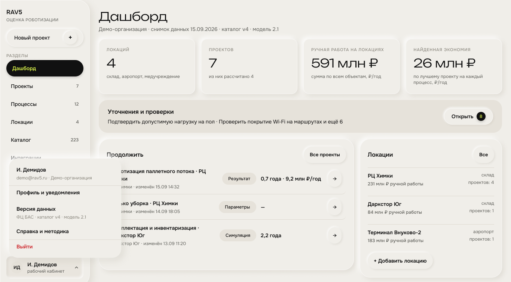

# 8. Дашборд

*Экран 06 «Дашборд» в Figma.*

Подпись экрана: «…сводка: локации, проекты, стоимость ручного труда, найденная экономия» \[Экран «Дашборд»\]. Первая страница после входа. Показывает агрегированные данные по всем проектам и локациям пользователя.

## 8.1. Шапка

| **Элемент** | **На экране** | **Зачем** | **Статус** |
|----|----|----|----|
| Заголовок | Дашборд | — | Макет |
| Строка версий | «Демо-организация · снимок данных 15.09.2026 · каталог v4 · модель 2.1» | На каких данных и какой версии модели построены цифры \[ТЗ 3.1.5\] | Макет |

## 8.2. Четыре показателя

| **Показатель** | **Значение на экране** | **Подпись на экране** | **Как считаем — предложение** |
|----|----|----|----|
| Локаций | 4 | склад, аэропорт, медучреждение | Число локаций пользователя; подпись — типы объектов |
| Проектов | 7 | из них рассчитано 4 | Число проектов; «рассчитано» — проекты в состоянии «Оценка готова» (раздел 11.1) |
| Ручная работа на локациях | 591 млн ₽ | сумма по всем объектам, ₽/год | Сумма по всем процессам во всех локациях: численность × з/п gross × 12 × 1,302 \[ДС-Легенда\] |
| Найденная экономия | 26 млн ₽ | по лучшему проекту на каждый процесс, ₽/год | Для каждого процесса берётся максимальный годовой эффект среди проектов, где он есть, затем сумма. Так один процесс не считается дважды |

Формула ручной работы сходится с карточками процессов: «Перемещение паллет» 25 × 120 000 × 12 × 1,302 = 46,9 млн ₽ — на карточке 47 млн ₽; «Комплектация заказов» 100 × 100 000 × 12 × 1,302 = 156,2 млн ₽ — на карточке 156 млн ₽ \[ДС-Склад, Экран «Локация — процессы»\].

## 8.3. Блоки дашборда

| **Блок** | **Что на экране** | **Что делает** | **Статус** |
|----|----|----|----|
| Уточнения и проверки | «Подтвердить допустимую нагрузку на пол · Проверить покрытие Wi-Fi на маршрутах и ещё 6»; кнопка «Открыть» со счётчиком 8 | Список того, что нужно проверить на объекте, чтобы расчёт стал надёжнее | Макет; источник пунктов — открытый вопрос |
| Продолжить | Последние проекты: название · локация · дата изменения · статус · результат; кнопка «Все проекты» | Возврат к незаконченной работе | Макет |
| Локации | Название · тип · ручная работа ₽/год · число проектов; кнопки «Все» и «+ Добавить локацию» | Быстрый переход к локации | Макет |

**Проекты в блоке «Продолжить»**

| **Проект** | **Локация** | **Изменён** | **Статус** | **Результат** |
|----|----|----|----|----|
| Роботизация паллетного потока | РЦ Химки | 15.09 14:32 | Результат | 0,7 года · 9,2 млн ₽/год |
| Только уборка | РЦ Химки | 14.09 18:05 | Параметры | — |
| Комплектация и инвентаризация | Даркстор Юг | 13.09 11:20 | Симуляция | 2,2 года |

**Локации в блоке «Локации»**

| **Локация**        | **Тип**  | **Ручная работа** | **Проектов** |
|--------------------|----------|-------------------|--------------|
| РЦ Химки           | склад    | 231 млн ₽         | 4            |
| Даркстор Юг        | склад    | 84 млн ₽          | 1            |
| Терминал Внуково-2 | аэропорт | 183 млн ₽         | 1            |

Четвёртая локация в блок не поместилась — это ГКБ №17: 93 млн ₽ и 1 проект \[Экран 12\].

**Что проверить**

- **231 млн ₽ по РЦ Химки** равно сумме трёх процессов из пяти, видимых на карточках: 47 + 156 + 28. Если у двух других процессов тоже есть затраты, число не сходится. Жюри проверяет, что результаты воспроизводятся \[ТЗ 5.6\].

- **Статусы проекта.** На экране три: «Параметры», «Симуляция», «Результат». В прототипе v2 шагов четыре; предложение по стадиям списка — раздел 11.1.

- **Откуда «Уточнения и проверки».** Экран отрисован в Figma \[Экран «Дашборд · уточнения и проверки»\]: подпись «Что нужно сделать, чтобы проекты перестали опираться на допущения. Данные локации уточняются один раз — для всех её проектов», вкладки «Открытые 8 · Выполненные 2 · Все 10», колонки «Задача · Где · Приоритет · Тип». Задачи трёх типов: «Уточнение данных» — «Подтвердить допустимую нагрузку на пол · Высокий» и «Проверить покрытие Wi-Fi на маршрутах · Средний» по каждой локации со счётчиком решений, которые ждут подтверждения; «Проверка» — конфигурация на схеме; «Поставщики» — запрос КП. Источник пунктов — «нет данных» в профиле локации и «требует проверки» в подборе (10.5).
