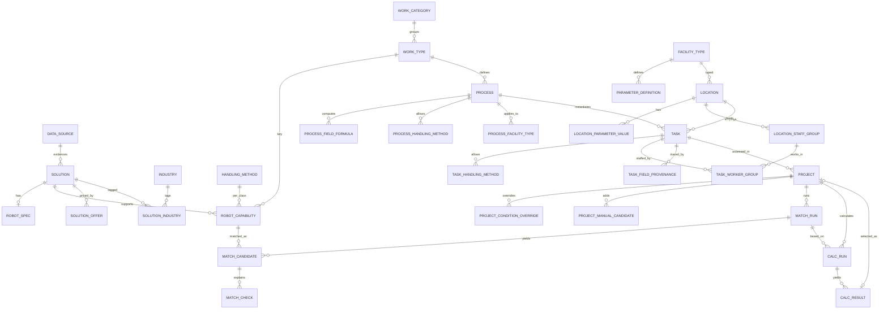

# Схема БД сервиса api

Postgres 16, миграции goose в `services/api/migrations/` применяются при старте сервиса. Во всех сущностях `id uuid` (v7 для новых записей, детерминированный v5 для seed), `created_at` и `updated_at`. Перечислимые значения — `text` с `CHECK`; словари, которые может расширять администратор, — отдельные таблицы. JSONB только для неизменяемых снимков: `project.snapshot` и `match_run.conditions`.

## 0001_reference — справочники и классы операций

- **`facility_type`** `(code PK, name_ru, sort)` — склад, аэропорт, медучреждение, свой объект.
- **`industry`** `(code PK, name_ru UNIQUE, sort)` — 9 отраслей каталога ФЦ БАС; на подбор не влияют.
- **`handling_method`** `(code PK, name_ru, hint_ru, sort)` — `forks`, `platform`, `tow`, `body`, `manipulator`, `brushes`, `none`.
- **`work_category`** `(code PK, name_ru, sort)` — вид работ: внутренняя логистика, фулфилмент, обслуживание объекта, учёт и контроль, безопасность.
- **`reference_version`** `(scope PK: catalog | dictionaries, version, label, updated_at)` — счётчики, растут при каждой записи в каталог или справочники; проект закрепляет их при создании.
- **`work_type`** — класс операции, ключ подбора. `code` (OP-NN, уникален, следующий из `work_type_code_seq`), `name`, `description`, `unit_label`, необязательная пара `action` + `handled_object` (уникальна, если заполнена), `typical_carriers`, `example_processes`, `work_category_code`, `is_active`.

## 0002_catalog — каталог

- **`data_source`** — источник данных (экран A6): `name`, `source_type` (specs, prices, cases, norms, dataset, catalog), `origin` (organizer, open, vendor, internal), `locator_kind` (file, url), `url`, `file_name`, `data_status` (confirmed, estimate), `provides`, `actualized_on`, `refresh_schedule`, `responsible`.
- **`solution`** — позиция каталога: робот или позиция для запуска. `code` (уникален: `MOROS-AMR800`, `RB-0001`, `SI-INF-01`, `FCB-xxxxxxxx`), `kind` (robot, infrastructure, software, service, support), `name`, `manufacturer`, `organizer_ids` (id строк catalog_export_v4 после склейки дублей), `product_class` (brs, bas, software), `type_group`, `solution_type`, `status` (operation, piloting, rnd), `trl` 1–9, `market_potential` 1–5, `region`, `country`, `description`, `cases_text`, `organizer_scenarios[]`, `acquisition_models[]`, значки `tested_by_fcbas`, `in_registry_719`, `photo_url`; для позиций запуска `cost_type` (capex, opex_year, percent), `quantity_rule`, `compatible_with`; справочно для economics `software_cost_pct`, `service_cost_pct`, `service_life_years`; `source_id`, `is_active`. Индексы: `(kind, is_active)`, `status`, GIN pg_trgm по `name || manufacturer`.
- **`solution_industry`** `(solution_id, industry_code)`.
- **`solution_offer`** — предложение с ценой. Дубли строк организатора с разной ценой — альтернативные предложения (Доп. 6). `label`, `price_rub` или `price_percent` (для `price_unit = percent_capex`), `price_includes_vat`, `price_unit` (item, year, percent_capex), `is_default` (одно на решение), `organizer_row_ref`, `source_id`.
- **`robot_spec`** — ТТХ робота, общие для всех его классов; `NULL` — значение неизвестно, проверка даст `unknown`. Грузоподъёмность и флаг «точное», габариты Д×Ш×В и флаг, масса, скорость, автономность, зарядка, мин./макс. температура и флаг, мощность, время загрузки/разгрузки, высота подъёма, точность позиционирования, навигация, способ обработки по умолчанию, допуски `indoor_allowed`/`outdoor_allowed`, мин. проезд, требования к полу, зарядке, связи, интеграциям, сервису; `specs_confirmed` (yes, partial, no), `specs_source_text`, `specs_source_id`, `specs_actualized_on`.
- **`robot_capability`** — робот × класс операции, `UNIQUE (solution_id, work_type_id)`. `throughput_per_hour` (в единице процесса), `throughput_range_text` (исходный диапазон), `throughput_exact`, `handling_method_code` и `environment` (indoor, outdoor, both) — пустые берутся из `robot_spec`; `lift_height_mm`, `source_text`, `source_id`, `is_active`. Частичный индекс по `work_type_id WHERE is_active`.

## 0003_process — процессы

Набор полей задачи `task_params` (все `numeric`, доли 0–1) есть и в `process` (значения по умолчанию), и в `task` (фактические значения): `cargo_unit`, `unit_mass_kg`, `cargo_divisible`, `route_points[]`, `daily_volume`, `work_hours_per_day`, `peak_factor`, `automation_share`, `route_length_m`, `site_speed_limit_mps`, `width_clearance_m`, `lift_trip_share`, `lift_time_s`, `environment` (indoor, outdoor), `min_aisle_width_m`, `min_operating_temp_c`, `required_lift_height_mm`, `turnover_rate`, `work_time_loss`, `fleet_operators_per_shift`, `fleet_operator_salary_rub`, `site_prep_share`, `it_integration_rub`, `consumables_per_robot_rub`, `other_effects_rub`.

- **`process`** — `code` (PR-NNNN), `name`, `description`, `work_type_id` (обязателен, ровно один класс), `work_category_code`, `kpi_unit`, `is_custom`, `created_from_location_id`, `owner_id`, `default_worker_role`, `default_worker_time_share`, `task_params`, `is_active`.
- **`process_facility_type`** `(process_id, facility_type_code)` — «где применяется».
- **`process_handling_method`** `(process_id, handling_method_code, labor_replacement_ratio)` — допустимые способы и коэффициент замещения труда.
- **`process_field_formula`** `(process_id, field_code, expression, description_ru)` — формула поля задачи по параметрам локации, например `wh_inbound_pallets + wh_outbound_pallets` или `sqrt(active_area)`.

## 0004_location_task — локации и задачи

- **`parameter_definition`** — параметр типа объекта из датасетов организатора: `code` (`wh_total_area`, `ap_baggage_day`, `med_portions_day`), `facility_type_code`, `group_name`, `name`, `unit`, `value_type` (number, integer, text, bool, enum, dimensions), `base_value_number`/`base_value_text`, `min_value`, `max_value`, `enum_values[]`, `is_required`, `is_constant`, `role` — общее имя для формул (`shifts_per_day`, `shift_hours`, `active_area`, `min_aisle_width`, `payroll_tax_coef`…), `staff_role` + `staff_attr` (headcount, salary) — параметр группы персонала, `form_section`, `hint`, `source_note`, `sort`.
- **`location`** — `name`, `facility_type_code`, `city`, `address`, бюджет `capex_budget_amount`/`currency`/`source_unit`/`source`, `horizon_years`, `is_demo`, `is_draft`, `owner_id`, `updated_by`, `deleted_at`.
- **`location_parameter_value`** `(location_id, parameter_code)` — `value_number` | `value_text` | `value_bool`, `source` (user, default, file, organizer, formula, assumption), `is_assumption`, `note`.
- **`location_staff_group`** — `role_name` (уникальна на локации), `headcount`, `salary_gross_month_rub`, `source`, `sort`.
- **`task`** — `location_id`, `process_id`, `work_type_id` (копия класса процесса, не меняется), `name`, `task_params`, `owner_id`, `archived_at`. `UNIQUE (location_id, process_id) WHERE archived_at IS NULL`.
- **`task_handling_method`** `(task_id, handling_method_code, labor_replacement_ratio)`.
- **`task_worker_group`** `(task_id, staff_group_id, time_share)` — исполнители и доля их времени.
- **`task_field_provenance`** `(task_id, field_code, source, expression, is_assumption, note)` — откуда значение: location, formula, process_default, user, file, organizer, assumption.

## 0005_project_matching — проекты и подбор

- **`project`** — `name`, `location_id`, `task_id` (ровно одна задача), `status` (с 0006 — draft, saved), `horizon_years`, `catalog_version`, `dictionaries_version`, `model_version` (версия ядра калькуляции, пишется при сохранении), `snapshot` (JSONB: локация, параметры, задача на момент закрепления; с 0006 — и выбранный робот), `snapshot_taken_at`, `pinned_solution_id` («Проверить на своём объекте»), `selected_solution_id`, `selected_acquisition_model` (purchase, raas), `copied_from_id`, `is_demo`, `owner_id`, `deleted_at`.
- **`project_condition_override`** `(project_id, check_code, value_number, value_text, value_list[], note)` — условия подбора, изменённые в проекте: handling, environment, payload, aisle_width, min_temperature, lift_height.
- **`project_manual_candidate`** `(project_id, solution_id, reason, added_at)`.
- **`match_run`** — прогон: `project_id`, `task_id`, `work_type_id`, `catalog_version`, `ruleset_version`, `conditions` (JSONB, вход прогона), счётчики `total_candidates`, `passed_count`, `verify_count`, `excluded_count`.
- **`match_candidate`** — `run_id`, `solution_id`, `capability_id`, `offer_id`, `state` (passed, needs_verification, excluded), `is_manual`, `transfer_flag` (P0–P3), `risks[]`, `summary_ru`, `sort`. `UNIQUE (run_id, solution_id)`.
- **`match_check`** `(candidate_id, check_code)` — `status` (pass, fail, unknown, not_applicable), `robot_value`, `required_value`, `unit`, `robot_value_source`, `required_value_source`, `message_ru`, `sort`.

## 0006_orchestrator — жизненный цикл проекта и расчёты

Оркестратор проекта описан в [../orchestrator.md](../orchestrator.md).

- **`project`**:
  - `status` — `draft` или `saved`; при миграции `result` стал `saved`, остальные значения — `draft`;
  - `saved_at` — когда проект сохранён;
  - `inputs_version` — счётчик изменений входа расчёта: снимок, условия, ручные кандидаты, горизонт;
  - `selected_calc_result_id` — выбранный результат расчёта.
- **`calc_run`** — расчёт кандидатов одного прогона подбора: `project_id`, `match_run_id`, `model_version`, `catalog_version`, `inputs_version` на момент запуска, `horizon_years`, `request` (JSONB: весь вход расчёта, включая поля каталога всех кандидатов). Если `inputs_version` расчёта не совпадает с проектом, расчёт устарел.
- **`calc_result`** — результат по паре «робот × модель приобретения»: `solution_id`, `acquisition_model` (purchase, raas), `calculable`, `reason`, `robot_count`, `charger_count`, `capex_rub`, `opex_year_rub`, `labor_savings_year_rub`, `net_effect_year_rub`, `payback_years` (пусто — не окупается), `roi`, `tco_rub`, `budget_over_rub`, `budget_over_pct`, `trace` (JSONB: шаги расчёта с формулой и источником), `warnings[]`, `sort`. `UNIQUE (calc_run_id, solution_id, acquisition_model)`.

## 0007_norms_economics — нормативы А5 и ответ сервиса economics

- **`norm_set`** — неизменная версия нормативов: `version` (уникальна, растёт с каждой правкой), `label`, `note`, `created_by`, `created_at`. Первую версию создаёт api при старте из `domain.NormDefinitions`.
- **`norm_value`** `(norm_set_id, code)` — норматив: `group_code` (staff, fleet, capex, opex, finance, interpretation, robot_defaults, ranking), `label`, `value`, `unit`, `kind` (norm, assumption), `source`, `sort`. Коды экономических нормативов совпадают с полями `NormsDto` сервиса economics.
- **`project.norm_set_id`** — закреплённая версия; пишется при создании и `refresh-snapshot`. Пусто у проектов до 0007: они считаются на последней версии.
- **`calc_run`**: `norm_set_id` — версия нормативов расчёта, `ranking_version` — методика рейтинга (`ranking-v1`; пусто у мок-модели). Весь набор нормативов лежит и во входе `request.norms`.
- **`calc_result`**: `rank` (место среди показанных пар «решение + модель»), `score` (0–1), `feasibility` (high, medium, low, none), `details` (JSONB: `capexItems`, `opexItems`, `baselineOpexYearRub`, `baselineTcoRub`, `fleetUtilization`, `cycleTimeS`, `scoreCriteria`, `assumptions`).

## Правила целостности

- Каталожные сущности (`work_type`, `solution`, `robot_capability`, `process`) не удаляются, а скрываются: `is_active = false`. Сохранённые прогоны и снимки продолжают на них ссылаться.
- Задача, которая есть в проектах, при удалении архивируется (`archived_at`), иначе удаляется.
- Удаление локации мягкое (`deleted_at`) и архивирует её задачи; проекты сохраняют снимок и показывают `locationDeleted`.
- Проект видит устаревание: `dataChanged` — задача или локация изменились после `snapshot_taken_at`; `catalogUpdated` — текущий `reference_version.catalog` больше закреплённого; `normsUpdated` — есть версия нормативов новее закреплённой.
- Расчёты не удаляются при повторном расчёте: история `calc_run` остаётся, проект указывает на выбранный результат. Сохранённый проект (`saved`) не меняет входы и расчёт, пока его не откроют (`reopen`).
