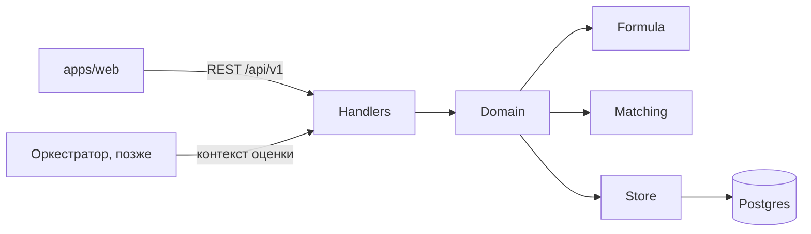
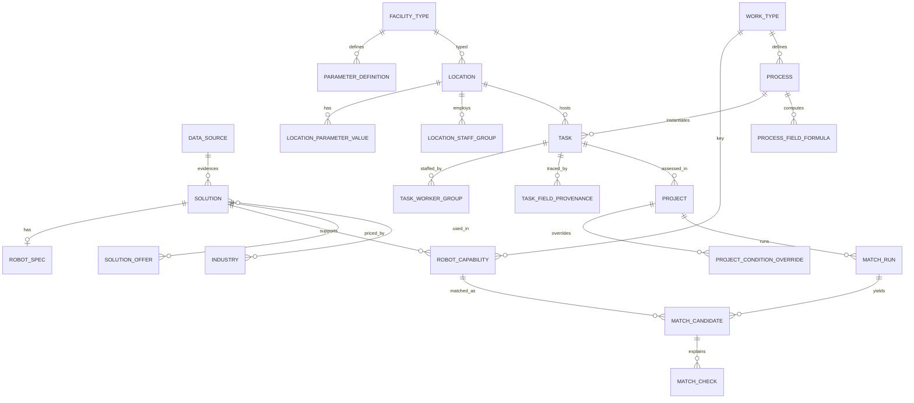

# План: сервис api — локации, задачи, проекты, каталог, классы операций, подбор

Язык документации — русский. Имена в коде, SQL и JSON — английские. Рядом лежат [README.md](README.md) (запуск и карта API), [db-schema.md](db-schema.md), [matching-rules.md](matching-rules.md) и [seed-data.md](seed-data.md).

## Статус реализации

Этапы 1–6 плана выполнены в ветке `feat/api`. Отступления от плана:

- **Контракт генерируется из Go-типов, а не наоборот.** Вместо oapi-codegen (spec-first) обработчики написаны на chi вручную, а `packages/contracts/openapi/api.yaml` генерируется из структур запросов и ответов (swaggest/openapi-go, `go generate ./...`). Так спецификация не может разойтись с кодом: тест сверяет маршруты роутера со списком операций, CI падает, если сгенерированный файл не закоммичен.
- **Добавлен слой `internal/service`** между обработчиками и хранилищем: там сценарии (задача из процесса, снимок проекта, прогон подбора) и валидация.
- **PATCH — JSON merge patch** поверх текущего редактируемого состояния сущности: переданные поля заменяются, `null` очищает, вложенные объекты сливаются, неизвестные поля отклоняются.
- **Go 1.26** вместо 1.23: этого требует goose v3.28; базовый образ Dockerfile обновлён.
- **Параметров в датасетах 132, а не 138**: бюджет CAPEX и горизонт расчёта (по 3 строки) — типизированные колонки локации, а не параметры.
- **Схема БД чуть шире плана**: `solution_offer.price_percent` для цен в % от CAPEX, `parameter_definition.staff_role/staff_attr` для численности и окладов групп персонала, `site_prep_share` вместо `site_prep_pct` (все доли от 0 до 1), колонки `sort` для порядка кандидатов и проверок. Итоговая схема — в [db-schema.md](db-schema.md).

## 1. Границы

**Входит в сервис:**
- Справочники: типы объектов, отрасли, способы обработки груза, виды работ, классы операций (Work Type).
- Каталог: роботы и позиции для запуска (инфраструктура, ПО, сервисы, поддержка), ТТХ, строки Robot Capability, предложения с ценой, источники данных.
- Справочник процессов с значениями по умолчанию и формулами.
- Локации: параметры по типу объекта и группы персонала.
- Задачи: процесс, развёрнутый на локации.
- Проекты: ровно одна задача, снимок входных данных, закреплённые версии, переопределённые условия, ручные кандидаты, выбранная конфигурация.
- Подбор: совпадение класса операции, жёсткие проверки со статусами pass, fail или unknown и причинами.
- Seed демо-данных для склада, аэропорта и медучреждения. Сводка для дашборда.

**Не входит** (по ответу: только seed и CRUD):
- Авторизация и роли. В таблицах заранее есть `owner_id` и `is_demo`, чтобы потом добавить их без ломки схемы.
- Оркестратор, расчёт парка и экономики, скоринг, симуляция, отчёты.
- Реестр нормативов (экран A5) и переопределение нормативов в проекте.
- Импорт Excel/CSV через UI и шаблоны; «Обновить каталог по запросу» (A1а); версии каталога с предпросмотром (A04).
- Журнал изменений; документы локации (17б); загрузка фото (в карточке остаётся `photo_url`).

**Что я отдаю соседям:** контракт результата подбора (кандидаты и проверки), а также контекст задачи и локации для economics и оркестратора. Поля экрана «Подбор»: N роботов, CAPEX, балл, окупаемость — их отдаёт оркестратор, не этот сервис.

## 2. Принятые решения

- **Гибридный ключ подбора.** `work_type` — класс операции OP-01…OP-10, как в Figma A8/A9: код, название, описание, единица. К ним добавлены необязательные `action` и `handled_object` из PRD. `robot_capability` — строка «робот × класс». Производительность, способ обработки и среда на строке необязательны; если поле пустое, берётся значение из ТТХ робота. Для экрана A2 (робот с набором классов в виде чипов) API отдаёт упрощённую форму.
- **Один проект — одна задача** (решение из synthesis). Окно «Конфигурация выбрана не для всех задач» из PRD 14.2.10 устарело.
- **Задача — копия шаблона процесса** на локации (Figma 15а). Класс операции копируется при создании и потом не меняется. Значения вычисляются по формулам процесса из параметров локации, у каждого поля хранится источник.
- **Хранение локации.** Идентичность, бюджет CAPEX и горизонт — обычные типизированные колонки. Параметры типа объекта (138 штук из датасетов) хранятся парой `parameter_definition` + `location_parameter_value`. Новые типы объектов добавляются данными, без правки схемы (ТЗ 3.2.6).
- **Мягкое удаление.** Роботы, строки capability, классы и процессы скрываются через `is_active=false`. Задачи архивируются (`archived_at`), локации и проекты удаляются мягко (`deleted_at`). Так сохранённые проекты остаются воспроизводимыми (ТЗ 3.1.5).
- **Версии.** Таблица `reference_version` со счётчиками `catalog` и `dictionaries`, счётчик растёт при каждой записи. Проект закрепляет оба номера и хранит неизменяемый снимок `snapshot`: локация и задача на момент закрепления. Полные версии каталога с предпросмотром вне рамок; воспроизводимость подбора дают сохранённые значения в проверках.
- **Перечислимые значения.** Статусы — `text` с `CHECK`. Словари, которые может расширять администратор, — отдельные таблицы.

## 3. Устройство сервиса

Стек:
- Go 1.23, роутер chi v5, драйвер pgx v5 с pgxpool.
- Миграции goose v3, встроены через `embed` и выполняются при старте.
- Контракт: спецификация в `packages/contracts/openapi/api.yaml`, код генерирует oapi-codegen v2 (chi strict server и модели).
- Swagger UI встроен в бинарник через swaggest/swgui, работает без интернета (ТЗ 4.2.7).
- Формулы процессов вычисляет expr-lang/expr. Логирование — slog.

```text
services/api/
  cmd/api/main.go              serve | migrate | seed
  internal/config/             env: HTTP_ADDR, DATABASE_URL, SEED_DEMO, MIGRATE_ON_START
  internal/apigen/             сгенерированный код + копия openapi.yaml (embed)
  internal/handlers/           реализация strict-интерфейса, ошибки RFC 7807
  internal/domain/             catalog, worktype, process, location, task, project
  internal/matching/           чистый движок проверок, без БД
  internal/formula/            вычисление формул процесса по параметрам локации
  internal/store/              репозитории на pgx
  internal/seed/               загрузчик seed/ (идемпотентный upsert по кодам)
  migrations/                  0001…0005 *.sql
  seed/                        csv/yaml демо-данных (внутри services/api — это контекст Docker-сборки)
```



## 4. Структура БД



Во всех таблицах `id uuid` (v7), `created_at` и `updated_at timestamptz`. Ниже эти поля опущены.

**0001_reference.sql** — справочники и классы операций

```sql
facility_type(code PK, name_ru, sort)                 -- warehouse, airport, medical, custom
industry(code PK, name_ru)                            -- 9 отраслей каталога
handling_method(code PK, name_ru, hint_ru)            -- forks, platform, tow, body, manipulator, brushes, none
work_category(code PK, name_ru)                       -- internal_logistics, fulfillment, facility_maintenance, accounting_control, security
reference_version(scope PK, version int, label, updated_at)   -- catalog, dictionaries
work_type(
  id PK, code text UNIQUE NOT NULL,                   -- OP-01…, следующий из work_type_code_seq
  name NOT NULL, description, unit_label NOT NULL,    -- «паллет», «строк», «м²», «ед.»
  action NULL, handled_object NULL,                   -- пара из PRD, необязательна
  typical_carriers, example_processes, work_category_code FK NULL,
  is_active bool DEFAULT true)
UNIQUE (action, handled_object) WHERE both NOT NULL
```

**0002_catalog.sql** — каталог

```sql
data_source(id PK, name NOT NULL,
  source_type CHECK in (specs, prices, cases, norms, dataset, catalog),
  origin CHECK in (organizer, open, vendor, internal),
  locator_kind CHECK in (file, url), url, file_name,
  data_status CHECK in (confirmed, estimate), provides, actualized_on date NOT NULL,
  refresh_schedule CHECK in (manual, daily, weekly, biweekly, monthly, quarterly), responsible)

solution(id PK, code UNIQUE NOT NULL,                 -- MOROS-AMR800, RB-0224
  kind CHECK in (robot, infrastructure, software, service, support),
  name NOT NULL, manufacturer NOT NULL, organizer_ids text[],   -- id строк catalog_export_v4 после склейки дублей
  product_class CHECK in (brs, bas, software), type_group, solution_type,
  status CHECK in (operation, piloting, rnd), trl smallint CHECK 1..9, market_potential CHECK 1..5,
  region, country, description, cases_text, organizer_scenarios text[], acquisition_models text[],
  tested_by_fcbas bool, in_registry_719 bool, photo_url,
  cost_type CHECK in (capex, opex_year, percent), quantity_rule, compatible_with,   -- позиции для запуска
  software_cost_pct, service_cost_pct, service_life_years,                          -- справочно, читает economics
  source_id FK data_source NULL, is_active bool DEFAULT true)
solution_industry(solution_id FK CASCADE, industry_code FK, PK both)
solution_offer(id PK, solution_id FK CASCADE, label, price_rub numeric(14,2) CHECK > 0,
  price_includes_vat bool DEFAULT true, price_unit CHECK in (item, year, percent_capex),
  is_default bool, organizer_row_ref, source_id FK NULL)
  UNIQUE (solution_id) WHERE is_default                -- дубли с разной ценой — альтернативные предложения (Доп. 6)

robot_spec(solution_id PK FK CASCADE,
  payload_kg, payload_exact, length_mm, width_mm, height_mm, dimensions_exact, mass_kg,
  max_speed_mps, autonomy_h, charge_time_min, min_temp_c, min_temp_exact, max_temp_c, avg_power_kw,
  load_time_s, unload_time_s, lift_height_mm, positioning_accuracy_mm, navigation_type,
  handling_method_code FK NULL, indoor_allowed bool NULL, outdoor_allowed bool NULL,  -- NULL = неизвестно, проверка даст unknown
  min_passage_mm, floor_requirements, charging_infra, connectivity text[], integrations text[], service_terms,
  specs_confirmed CHECK in (yes, partial, no), specs_source_text, specs_source_id FK NULL, specs_actualized_on date)

robot_capability(id PK, solution_id FK CASCADE, work_type_id FK,
  throughput_per_hour numeric CHECK > 0 NULL, throughput_range_text, throughput_exact bool DEFAULT false,
  handling_method_code FK NULL, environment CHECK in (indoor, outdoor, both) NULL,   -- NULL → берётся из robot_spec
  lift_height_mm NULL, source_text, source_id FK NULL, is_active bool DEFAULT true,
  UNIQUE (solution_id, work_type_id))
```

Индексы: `pg_trgm` GIN на `solution(name, manufacturer)` для поиска; `solution(kind, is_active)`; `solution(status)`; `robot_capability(work_type_id) WHERE is_active`.

**0003_process.sql** — процессы. Здесь впервые появляется общий набор полей задачи `task_params`. В `process` он хранит значения по умолчанию (все поля nullable), в `task` — фактические значения. Поля взяты из форм Figma 09а и 16, разделы 1–5.

```sql
-- task_params:
cargo_unit, unit_mass_kg, cargo_divisible bool, route_points text[],
daily_volume, work_hours_per_day, peak_factor, automation_share CHECK 0..1,
route_length_m, site_speed_limit_mps, width_clearance_m, lift_trip_share, lift_time_s,
environment CHECK in (indoor, outdoor), min_aisle_width_m, min_operating_temp_c, required_lift_height_mm,
turnover_rate, work_time_loss, fleet_operators_per_shift, fleet_operator_salary_rub,
site_prep_pct, it_integration_rub, consumables_per_robot_rub, other_effects_rub

process(id PK, code UNIQUE, name NOT NULL, description, work_type_id FK NOT NULL,
  work_category_code FK, kpi_unit, is_custom bool, created_from_location_id NULL, owner_id NULL,
  default_worker_role, default_worker_time_share, <task_params как значения по умолчанию>, is_active)
process_facility_type(process_id FK CASCADE, facility_type_code FK, PK)            -- «где применяется»
process_handling_method(process_id FK CASCADE, handling_method_code FK, labor_replacement_ratio CHECK 0..1, PK)
process_field_formula(process_id FK CASCADE, field_code, expression NOT NULL, description_ru, PK(process_id, field_code))
  -- пример: daily_volume = "wh_inbound_pallets + wh_outbound_pallets"; route_length_m = "sqrt(active_area_m2)"
```

**0004_location_task.sql** — локации и задачи

```sql
parameter_definition(code PK,                         -- wh_total_area, ap_apron_area, med_beds…
  facility_type_code FK, group_name, name, unit,
  value_type CHECK in (number, integer, text, bool, enum, dimensions),
  base_value_number, base_value_text, min_value, max_value, enum_values text[],
  is_required bool, is_constant bool, role NULL,      -- общее имя для формул: shifts_per_day, shift_hours, active_area_m2, aisle_width_m…
  form_section CHECK in (basic, area, schedule, staff, object_params), hint, source_note, sort)
  UNIQUE (facility_type_code, role) WHERE role NOT NULL

location(id PK, name NOT NULL, facility_type_code FK, city NOT NULL, address,
  capex_budget_amount numeric(16,2), capex_budget_currency char(3) DEFAULT 'RUB',
  capex_budget_source_unit, capex_budget_source, horizon_years,
  is_demo bool, is_draft bool, owner_id NULL, updated_by, deleted_at)
location_parameter_value(location_id FK CASCADE, parameter_code FK,
  value_number, value_text, value_bool,
  source CHECK in (user, default, file, organizer, formula, assumption), is_assumption bool, note,
  PK(location_id, parameter_code), CHECK num_nonnulls(value_*) <= 1)
location_staff_group(id PK, location_id FK CASCADE, role_name NOT NULL,
  headcount int CHECK >= 0, salary_gross_month_rub CHECK > 0 NULL, source, sort,
  UNIQUE(location_id, role_name))

task(id PK, location_id FK, process_id FK, work_type_id FK,   -- класс копируется при создании
  name NOT NULL, <task_params>, owner_id NULL, archived_at)
  UNIQUE (location_id, process_id) WHERE archived_at IS NULL    -- в 15а это пометка «уже на локации»
task_handling_method(task_id FK CASCADE, handling_method_code FK, labor_replacement_ratio, PK)
task_worker_group(task_id FK CASCADE, staff_group_id FK CASCADE, time_share CHECK 0..1, PK)
task_field_provenance(task_id FK CASCADE, field_code,
  source CHECK in (location, formula, process_default, user, file, organizer, assumption),
  expression, is_assumption bool, note, PK(task_id, field_code))   -- «из локации / формула / допущение»
```

**0005_project_matching.sql** — проекты и подбор

```sql
project(id PK, name NOT NULL, location_id FK, task_id FK NOT NULL,
  status CHECK in (params, matching, simulation, economics, result) DEFAULT 'params',
  horizon_years, catalog_version int, dictionaries_version int, model_version NULL,   -- model_version заполняет оркестратор
  snapshot jsonb NOT NULL, snapshot_taken_at,       -- неизменяемая копия локации и задачи
  pinned_solution_id FK solution NULL,              -- вход «Проверить на своём объекте»
  selected_solution_id FK NULL, selected_acquisition_model CHECK in (purchase, raas) NULL,
  copied_from_id FK project NULL, is_demo, owner_id NULL, deleted_at)
project_condition_override(project_id FK CASCADE, check_code,
  value_number, value_text, value_bool, value_list text[], note, PK(project_id, check_code))   -- панель 12a
project_manual_candidate(project_id FK CASCADE, solution_id FK, reason, added_at, PK)

match_run(id PK, project_id FK CASCADE, task_id FK, work_type_id FK, catalog_version, ruleset_version,
  conditions jsonb NOT NULL,                        -- вычисленные условия с источниками, вход прогона
  total_candidates, passed_count, verify_count, excluded_count)
match_candidate(id PK, run_id FK CASCADE, solution_id FK, capability_id FK NULL, offer_id FK NULL,
  state CHECK in (passed, needs_verification, excluded), is_manual bool,
  transfer_flag CHECK in (P0, P1, P2, P3) NULL, risks text[], summary_ru,
  UNIQUE(run_id, solution_id))
match_check(candidate_id FK CASCADE, check_code,
  status CHECK in (pass, fail, unknown, not_applicable),
  robot_value, required_value, unit, robot_value_source, required_value_source, message_ru NOT NULL,
  PK(candidate_id, check_code))
```

JSONB используется только для неизменяемых снимков (`project.snapshot`, `match_run.conditions`). Все значения, которые участвуют в расчётах, хранятся в типизированных колонках — как рекомендует архитектура.

**Seed** (`services/api/seed/`, загружается при `SEED_DEMO=true`, повторный запуск ничего не дублирует):
- Справочники, классы OP-01…OP-10 (из Figma A8), 6 источников данных (из A6).
- `catalog_export_v4.csv` (копия из `tmp/Датасет`): 223 строки склеиваются в 187 позиций по id. Цена «2 700 000,00» разбирается в число. Написание подтипов нормализуется. Разные цены одного продукта превращаются в альтернативные `solution_offer`. Класс операции подсказывается по «Сценарию», если соответствие однозначное (PRD 7.6).
- ТТХ и классы примерно для 15 демо-роботов: из листа «Каталог» экономической модели, PRD Б.2 и Figma A1. Например, AMR 800 → OP-01 и OP-08, Ronavi SD → OP-08.
- 29 позиций для запуска из PRD 13.5 со статусом `estimate`.
- 138 определений параметров из `Датасеты_хакатон.xlsx`. Разовый скрипт `scripts/extract_datasets.py` выгружает их в `parameters.csv`, файл коммитится.
- 12 процессов из Figma 07 со значениями по умолчанию и формулами.
- 4 демо-локации (РЦ Химки, Даркстор Юг, Терминал Внуково-2, ГКБ №17) с группами персонала и задачами, плюс демо-проект «Роботизация паллетного потока · РЦ Химки».

## 5. Правила подбора (`internal/matching`, ruleset `match-rules/v1`)

1. **Кандидаты.** Это активные `robot_capability` с `work_type_id` задачи, у активного `solution` вида `robot`. Робот без такой строки кандидатом не считается и в «исключённые» не попадает (PRD 16.1). Ручные кандидаты и закреплённый продукт (`pinned_solution_id`) проходят все проверки, включая `work_type`, с пометкой `is_manual`.
2. **Условия.** Берутся из задачи (там уже подставлены значения из локации и формул) и перекрываются `project_condition_override`. Условие задаётся в поле задачи, поэтому скрытых коэффициентов нет.
3. **Проверки.** Для каждой сохраняются значение робота, требуемое значение, единица и источник обоих.
   - `handling`: способ обработки из строки capability или из ТТХ робота должен входить в допустимые способы задачи.
   - `environment`: среда строки capability или флаги робота `indoor_allowed`/`outdoor_allowed` против среды задачи.
   - `payload`: `payload_kg ≥ unit_mass_kg`, если груз неделимый. Если делимый — `pass` с пометкой, что число рейсов считает calc.
   - `aisle_width`: `width_mm/1000 + width_clearance_m ≤ min_aisle_width_m`.
   - `min_temperature`: `min_temp_c ≤ min_operating_temp_c`.
   - `lift_height`: высота подъёма робота не меньше требуемой. Если в задаче требования нет — `not_applicable`.
   - `price`: у решения есть предложение с ценой по умолчанию. Если нет — `fail`: без цены экономику не посчитать. Остальные проверки при этом всё равно показываются.
4. **Итоговое состояние.** Любой `fail` → `excluded`. Иначе любой `unknown` → `needs_verification`. Иначе → `passed`.
5. **Риски** (записываются в `risks`, на состояние не влияют): `specs_unconfirmed`, если `specs_confirmed ≠ yes`; `throughput_unknown`, если производительность неизвестна или неточная; `P3`, если статус `rnd` или УГТ < 7. Правила для P0–P2 — открытый вопрос.

## 6. API (`/api/v1`, JSON в camelCase, ошибки RFC 7807)

Ошибки проверки — `422` со списком `errors: [{field, code, message, hint, allowed}]` на русском, в каждом — способ исправить (ТЗ 4.5.4). Дубли — `409`. Списки возвращаются как `{items, total}`, параметры `limit` и `offset`.

**Служебное:** `GET /healthz`, `GET /readyz`, `GET /docs` (Swagger UI), `GET /api/v1/openapi.yaml`.

**Справочники и версии:**
- `GET /dictionaries` — все выпадающие списки одним запросом.
- `GET /versions` — версии каталога и справочников для строки «Версия данных».

**Классы операций:** `GET /work-types` (со счётчиками роботов и процессов), `GET /work-types/{id}`, `POST` (код назначается автоматически), `PATCH`, `DELETE` (скрывает).

**Каталог:**
- `GET /solutions` с фильтрами:
  - `kind`, `q`, `workTypeIds[]`, `industry[]`, `facilityType`, `status[]`, `trlMin`;
  - `priceBand` = `lte1m` | `1to3m` | `gt3m` (граница относится к нижнему диапазону), `costType`;
  - `hasCapabilities`, `specsConfirmed`, `includeHidden`;
  - `sort` = relevance | price_asc | price_desc | trl | confirmation | updated.
- В каждом элементе списка: `completenessPct`, `missingSpecs[]`, чипы классов, цена по умолчанию, значки.
- `GET /solutions/{id}` — полная карточка с числом проектов, где используется. `POST /solutions`, `PATCH /solutions/{id}`, `DELETE` (скрывает).
- `PUT /solutions/{id}/capabilities` — заменить набор классов (чипы A2). `PATCH` и `DELETE /solutions/{id}/capabilities/{capId}` — атрибуты отдельной строки.
- `GET /solutions/compare?ids=` — единая таблица характеристик по группам ТЗ 3.3.
- Источники: `GET`, `POST`, `PATCH`, `DELETE /data-sources`.

**Процессы:**
- `GET /processes` — фильтры `q`, `workTypeId`, `facilityType`, `category`, `isCustom`; в ответе значения по умолчанию, `robotsCount`, `locationsCount`.
- `GET /processes/{id}` — шаблон, формулы и задачи на локациях (экран 11).
- `GET /processes/{id}/robots` — роботы с этим классом, сгруппированные: ТТХ подтверждены / есть ограничения / мало данных.
- `POST /processes` (справочный процесс или пользовательский с `createdFromLocationId`), `PATCH`, `DELETE` (скрывает), `POST /processes/{id}/duplicate`.

**Локации:**
- `GET /facility-types/{code}/parameters` — определения полей для построения формы.
- `GET /locations/templates` и `POST /locations/from-template` — типовой объект из датасета.
- `GET /locations` — фильтры и сортировки из экрана 12; в каждой карточке площадь, персонал, смены, число задач, ФОТ в год, заполненность параметров в %, число допущений и проектов.
- `POST /locations`, `GET /locations/{id}` (с готовностью «8/9 обязательных» и ошибками), `PATCH`, `DELETE`.
- `GET /locations/{id}/parameters` и `PUT` (массовое обновление), `PUT /locations/{id}/staff-groups`.

**Задачи:**
- `GET /locations/{id}/tasks` — карточки с готовностью «9/9» или «Не хватает N: …», числом роботов и затратами на персонал.
- `POST /locations/{id}/tasks` — задача из шаблона процесса; с `?dryRun=true` возвращает только вычисленные значения.
- `GET /tasks/{id}` — значения, их источники и производные: пиковая интенсивность, к роботизации в пик, среднечасовая, целевые FTE, ФОТ.
- `PATCH /tasks/{id}` — `assumeDefaults: [field]` работает как кнопка «Не знаю».
- `DELETE /tasks/{id}` — архивирует, если задача есть в проекте, иначе удаляет.
- `GET /tasks/{id}/match-preview` — подбор без сохранения: «Подходящие роботы · 4 из 36».

**Проекты и подбор:**
- `GET /projects` — фильтры `locationId`, `status`, `q`, `sort`.
- `POST /projects` — `locationId`, `taskId`, `name?`, `pinnedSolutionId?`. Создаёт снимок и закрепляет версии.
- `GET /projects/{id}` — с флагом `dataChanged`, `PATCH`, `DELETE`.
- `POST /projects/{id}/copy`, `POST /projects/{id}/refresh-snapshot`.
- `GET /projects/{id}/conditions`, `PUT` и `DELETE` — условия подбора для панели 12a, у каждого метка «из задачи», «формула» или «проект».
- `POST /projects/{id}/matching-runs` — запустить подбор. `GET /projects/{id}/matching-runs/latest`, `GET /matching-runs/{id}` — кандидаты по состояниям с проверками.
- `POST` и `DELETE /projects/{id}/manual-candidates` — ручные кандидаты.
- `PUT /projects/{id}/selection` — выбранная конфигурация.
- `GET /projects/{id}/evaluation-context` — контракт для оркестратора: задача, локация, кандидаты, ТТХ и capability.

**Дашборд:** `GET /dashboard/summary` — локации по типам, проекты, ручной труд в ₽ в год. `foundSavings` пока `null` — его даст оркестратор.

## 7. Экраны Figma и API

Ряды A, B и C раздела «dev» (`node 15935:2`) я проверил по макету. Экраны проекта сопоставлены по реестру PRD (приложение В): Figma упёрся в лимит вызовов, поэтому экран 18 и экраны проекта в новом разделе я не открывал.

- **A1 каталог, A3 успех:** `GET /solutions?kind=robot&includeHidden`. **A1а обновление:** вне рамок, кнопку скрыть или сделать заглушкой.
- **A2 новый робот:** `GET /dictionaries`, `GET /work-types`, `POST /solutions` + `PUT capabilities`. Фото — только `photoUrl`.
- **A5 нормативы:** вне рамок. **A6, A7, A7б источники:** `/data-sources`; кнопки «Обновить» и «Проверить» вне рамок.
- **A8, A9 классы операций:** `/work-types`.
- **05 вход:** без авторизации. **06 дашборд:** `/dashboard/summary`, `/projects`, `/locations`.
- **07 процессы:** `/processes` + `/work-types`. **09а новый процесс:** `POST /processes`. **11 карточка процесса:** `/processes/{id}` и `/processes/{id}/robots`.
- **12 и 12а список локаций:** `/locations`. **13 и typical:** `/locations/templates`. **14 новая локация:** `/facility-types/{code}/parameters`, `POST /locations`.
- **15, 15а, 17 задачи локации:** `/locations/{id}`, `/locations/{id}/tasks`, `/processes?facilityType=`, `POST /locations/{id}/tasks`.
- **16 задача:** `GET` и `PATCH /tasks/{id}`. **17в удаление:** `DELETE /tasks/{id}`. **17а параметры:** `/locations/{id}/parameters`. **17б документы:** вне рамок.
- **18 подходящие роботы:** `/tasks/{id}/match-preview`.
- **projects, np, npnew, nptyp, rowmenu, delete, versions, saved:** `/projects*` (copy, delete, `dataChanged`, refresh-snapshot).
- **params, conds:** `/projects/{id}` и `/conditions`. **podbor:** matching-runs и manual-candidates (балл и экономика — от оркестратора). **e7, e8:** `POST /locations/{id}/tasks`, затем новый проект.
- **catalog, catfilt, catdrop, catind, catready, catcost, catsort, solution, compare:** `/solutions*`.
- **Вне рамок:** sim0–3, econ и панели экономики, calc, weights, result, report, kp, integr, modal (устарел).

## 8. Этапы

1. **Каркас.** Зависимости, `main` с командами `serve`, `migrate` и `seed`, конфиг, `/healthz` и `/readyz`, goose, заготовка OpenAPI, генерация кода, Swagger UI, workflow CI. В `.env.example` добавить `SEED_DEMO` и `MIGRATE_ON_START`. Документы в `docs/api/`.
2. **Справочники и каталог.** Миграции 0001–0002, импорт CSV, seed демо-роботов, API классов, каталога, сравнения и источников.
3. **Процессы.** Миграция 0003, пакет `formula`, 12 процессов, API процессов.
4. **Локации и задачи.** Миграция 0004, 138 определений параметров, 4 демо-локации, проверка по диапазонам, создание задачи из шаблона, готовность и производные показатели.
5. **Подбор и проекты.** Миграция 0005, движок `matching`, match-preview, проекты со снимком, условиями, прогонами, ручными кандидатами и выбором, `evaluation-context`, дашборд.
6. **Доводка.** Интеграционные и «эталонные» тесты, тексты ошибок, индексы, `matching-rules.md`, прогон демо-сценария.

К промежуточной сдаче (ТЗ 8.1.4 — путь до подбора) нужны этапы 1–5.

## 9. Тесты и CI

**Модульные тесты** (обычный `go test`, работают внутри `docker build --target test`):
- табличные тесты на каждую проверку, включая `unknown` и `not_applicable`, и на итоговое состояние;
- формулы и вычисление значений задачи;
- готовность задачи и локации;
- разбор CSV: склейка дублей, цены, нормализация подтипов;
- тексты ошибок проверки.

**Интеграционные тесты** (`//go:build integration`, Postgres как service в GitHub Actions):
- миграции вверх и вниз, повторный seed ничего не дублирует;
- CRUD репозиториев;
- сквозной тест: локация → задача → проект → подбор.
- **Эталонный тест для РЦ Химки / OP-01:** проходят или требуют проверки AMR 800, Ronavi H1500, Ronavi M, DMR Carrier P. Исключены: AMR 100 и Ronavi RCM (грузоподъёмность); беспилотный тягач и EVOCARGO N1 (среда и способ обработки). MARK 2 SE и Ronavi SD кандидатами не являются.

**`.github/workflows/api.yml`** (запускается при изменениях в `services/api/**` и `packages/contracts/openapi/**`):
- `lint` — golangci-lint;
- `contract` — проверка спецификации (redocly lint), затем `go generate` и `git diff --exit-code`;
- `unit` — `go test -race`;
- `integration` — со службой postgres:16;
- `docker` — сборка стадий `test` и `runtime`, публикация в GHCR с main — по желанию.

`go.mod` поднять до `go 1.23`, как в Dockerfile.

## 10. Что согласовать с командой до кодирования

1. **Единица у класса операции.** OP-01 объединяет паллеты и багаж, у A9 одна «ед./ч». Предлагаю: единица объёма задаётся у процесса (`kpi_unit`), а производительность в строке capability — в единице этого процесса. Economics должен об этом знать.
2. **Правила P0–P2.** Нужна таблица «отрасль ↔ тип объекта». Пока считаем только P3.
3. **Фильтр каталога «Тип объекта».** Предлагаю выводить его через процессы, которые применимы к типу объекта и используют классы робота.
4. **Робот без цены.** Сейчас он исключается проверкой `price`, но остальные проверки видны: «технически подходит, нет цены». Нужно подтвердить.
5. **Производительность-диапазон.** В расчёт идёт нижняя граница, исходный текст диапазона хранится (PRD 7.9). Нужно подтвердить.
6. **Кнопки без бэкенда.** «Загрузить из Excel», «Скачать шаблон», «Обновить каталог», A5, 17б и загрузка фото есть в макетах, но вне рамок. Их нужно скрыть или назначить владельца.
7. **Контракт с оркестратором и economics.** Кто создаёт таблицы результатов расчёта (`configuration_result`, `simulation_run`) в общей базе api и владеет ими.
8. **Формат JSON.** camelCase, деньги — числом в рублях с `currency: RUB`. Нужно зафиксировать вместе с фронтендом.
