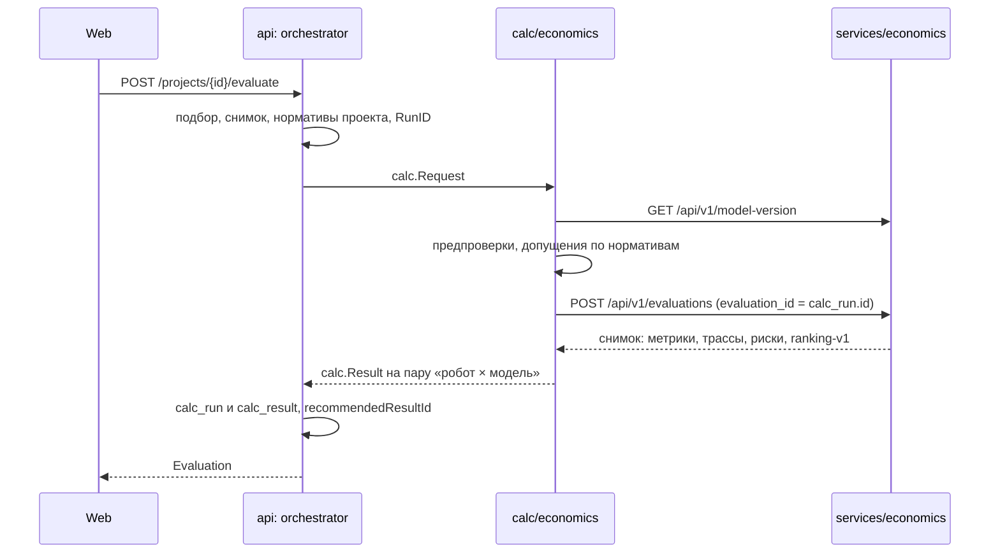

# Интеграция сервиса economics с оркестратором api

Ветка `feat/economics-integration`. Источник требований — PRD RAV5 0.9 (разделы 6.8, 11.3, 11.5, 14).

## Итог

Оркестратор api считает парк, экономику и рейтинг кандидатов через сервис economics. Мок-модель `mock-calc/v1` осталась для отладки: она включается пустым `ECONOMICS_URL`. На демо-проекте «РЦ Химки · перемещение паллет» сквозной расчёт в Docker совпадает с эталоном PRD 11.3/11.5:

| Показатель, AMR 800 | PRD · покупка | Расчёт · покупка | PRD · RaaS | Расчёт · RaaS |
|---|---|---|---|---|
| Роботов | 18 | 18 | 18 | 18 |
| CAPEX, млн ₽ | 47,4 | 47,39 | 6,1 | 6,09 |
| Годовой эффект, млн ₽ | 16,7 | 16,67 | 9,2 | 9,22 |
| Окупаемость, лет | 2,8 | 2,84 | 0,7 | 0,66 |
| Место в рейтинге | 4 | 5 | 1 | 1 |

OPEX расходится с PRD (30,2 и 37,7 млн ₽ против 34,5 и 42,0): в базе PRD есть обслуживание погрузчиков (4,3 млн ₽), а в модели economics его нет (см. бэклог).

Бизнес-логика economics не менялась: формулы, валидация домена, рейтинг и хранение снимков остались прежними. Правки затронули только HTTP-слой, проверку версии модели, readiness, экспорт контракта и тесты.

## Как устроено

## Что сделано

**api (Go)**

- Новый клиент [`internal/calc/economics`](../../services/api/internal/calc/economics/client.go) на родном контракте economics. Старый `calc/httpclient` удалён: он ходил на несуществующий `/api/v1/calculations`.
- Порт [`calc`](../../services/api/internal/calc/calc.go) расширен:
  - на входе — `RunID`, закреплённый набор нормативов и роли параметров локации (`shifts_per_day`, `available_power_kw`);
  - на выходе — `rank`, `score`, `feasibility` и `details`: статьи CAPEX и OPEX, базовый сценарий «текущий процесс», загрузка парка, время цикла, критерии рейтинга, подставленные допущения;
  - в трассе — входы каждого шага.
- Нормативы экрана А5:
  - таблицы `norm_set` и `norm_value`, определения и первая версия в [`domain/norms.go`](../../services/api/internal/domain/norms.go);
  - в наборе 34 строки PRD 6.8, `site_preparation_share`, две ТТХ по умолчанию и 8 весов рейтинга из PRD 11.3;
  - эндпоинты `GET /norms`, `GET /norm-sets[/{id}]`, `POST /norm-sets` (admin, версии неизменны).
- Проект закрепляет версию нормативов (`versions.norms`, флаг `normsUpdated`). `refresh-snapshot` переводит проект на новую версию. Горизонт по умолчанию берётся из нормативов.
- `Evaluation`: `rankingVersion`, `normsVersion`, `recommendedResultId`. Кандидаты отсортированы по лучшему месту.
- Миграция `0007_norms_economics.sql`, регенерированный `api.yaml`.

**economics (Python)**

- `GET /api/v1/model-version` возвращает `economic-v1.1` и `ranking-v1`.
- Реестр поддерживаемых версий модели [`model_versions.py`](../../services/economics/src/economic_service/model_versions.py): неизвестная `model_version` получает 409.
- `/readyz` проверяет БД (`SELECT 1`), Docker healthcheck переведён на `/readyz`.
- [`scripts/export_openapi.py`](../../services/economics/scripts/export_openapi.py) выгружает контракт в `packages/contracts/openapi/economics.yaml`. Тест не даёт контракту разойтись с кодом.

**Инфраструктура**

- Compose: `ECONOMICS_URL` по умолчанию `http://economics:8002`, `api` ждёт `economics: service_healthy`. Сид при старте считает демо-проекты через economics.
- CI economics запускается и при правке `economics.yaml`.

**Проверка**

- Go: юнит-тесты клиента на записанном ответе живого сервиса (`testdata/evaluation_response.json`), все пакеты и golangci-lint зелёные.
- Интеграция на Postgres: все прежние сценарии на мок-модели проходят. Новый `TestEconomicsFlow` на живом economics проверяет демо-проект, рейтинг, новую версию нормативов, неизменность сохранённого проекта и переход на новые нормативы после `refresh-snapshot`.
- Python: стадия `test` в Docker (ruff и pytest: 89 тестов, PostgreSQL-тесты идут в CI).
- Сквозной запуск `docker compose up api`: демо-цифры в таблице выше.

## Нюансы

1. **Decimal строками.** Pydantic v2 отдаёт `Decimal` JSON-строкой. Клиент отправляет числа строками (без ошибки float) и разбирает и строки, и числа. Текстовая метрика (интерпретация) распознаётся по тому, что не разбирается как число.
2. **Строгая схема.** `extra="forbid"` и обязательные nullable-поля: в DTO нет `omitempty`, пустые значения уходят явным `null`.
3. **422 на весь запрос.** Economics отклоняет весь расчёт из-за одного плохого значения. Поэтому клиент проверяет вход заранее:
   - без объёма, часов, пика, доли автоматизации, маршрута или массы груза сервис не вызывается, результаты «не рассчитано» с причиной;
   - горизонт меньше 5 лет — так же (модель требует от 5 лет, ТЗ 3.5.2);
   - пустой список кандидатов — так же;
   - цена ≤ 0 уходит как `null`.
4. **Декартово произведение.** Economics считает каждый сценарий для каждого кандидата. Пары с моделью, которую робот не предлагает, отбрасываются, места перенумеровываются. Нормировка баллов при этом всё же учитывает лишние пары.
5. **Скорость на объекте.** Economics требует `site_speed_limit_mps > 0`. Если в задаче пусто, передаётся максимальная скорость среди кандидатов: формула `min(скорость робота, ограничение)` тогда не ограничивает.
6. **Мощность локации.** Если доступная мощность не задана, риск «мощности не хватает» подавляется и заменяется предупреждением «не проверялась».
7. **ТТХ каталога.**
   - Без максимальной скорости робот остаётся «не рассчитано»: норматива скорости нет, и выдумывать её нельзя.
   - Время погрузки, разгрузки и средняя мощность подставляются из нормативов-допущений, с предупреждением и записью в `details.assumptions`.
   - Каталожная производительность (`capability.throughputPerHour`) economics не использует.
8. **Смены.** Число смен берётся из роли `shifts_per_day` локации, иначе `⌈часы процесса ÷ длительность смены (или 8 ч)⌉` с предупреждением.
9. **Показатели.**
   - OPEX — `annual_process_opex`: оставшийся ФОТ плюс новые расходы, как «Расходы процесса в год» в PRD 11.5.
   - TCO — `robotized_process_tco`.
   - ROI — `workbook_roi` (накопленный эффект ÷ CAPEX, ТЗ 3.5.2).
   - Балл ranking-v1 (0–100) приведён к 0–1.
10. **Веса рейтинга.** По умолчанию ranking-v1 и PRD 11.3 расходятся (эффект 15 против 10, полнота данных 5 против 10, расхождение 116). Веса передаются явно из нормативов, значения взяты из PRD.
11. **Версия модели.** Раньше economics принимал любую строку `model_version`, и воспроизводимость держалась на честности вызывающего. Теперь версию объявляет сервис, а чужую отклоняет.
12. **Два хранилища.**
    - Economics пишет аудиторский снимок в свою БД с `evaluation_id = calc_run.id`.
    - Api хранит свою копию для экрана и не читает снимки economics.
    - Весь набор нормативов замораживается в `calc_run.request`.
13. **Ошибки.**
    - 409 и 422 от economics дают 503 `calculation_rejected`, сеть и 5xx — 503 `calculation_unavailable`. В обоих случаях подбор сохранён.
    - Отклонение нарочно оформлено как «недоступность»: иначе сид на старте api падал бы вместо предупреждения.
14. **Лишний вызов.** Перед каждым расчётом клиент запрашивает `model-version`. Внутри сети это миллисекунды, но вызов можно кешировать.

## Бэклог

**P0 — качество цифр на демо**

- Economics: принимать каталожную производительность (`throughput_per_hour`) как альтернативу скорости и циклу. Сейчас многие позиции каталога без скорости не считаются.
- Economics: модели приобретения на уровне кандидата. Сейчас рейтинг нормируется и по парам, которые робот не предлагает.
- Economics: коды рисков и причин вместо английских строк. Сейчас перевод живёт словарём в Go, новые тексты показываются как есть.
- Economics: тексты формул в трассе (VAL-003). PRD 11.5 и ТЗ 3.5.8 требуют формулы, сейчас есть только `formula_id` и входы.
- Базовый сценарий: обслуживание текущей техники (погрузчики, 4,3 млн ₽ в примере PRD) — поле процесса на локации и статья в модели. Из-за этого расходится OPEX.

**P1 — полнота шагов «Подбор» и «Итог»**

- Чувствительность ±20 % по трём параметрам (ТЗ 3.5.6): после REL-002 в economics — `POST /projects/{id}/sensitivity` со сценариями `price/volume/labor_factor`.
- Панель «Параметры расчёта», what-if (ТЗ 3.5.3): переопределения 7 полей в проекте поверх снимка и нормативов, журнал правок.
- RaaS: по PRD 11.5 станции, связь и внедрение входят в CAPEX, economics их обнуляет. Модель RaaS согласовать с PRD (тариф, установочный платёж, индексация 5 %).
- Проверить базу `annual_connectivity_cost`: в А5 это «₽/год на объект», в трассе economics он зависит от числа роботов.
- NPV, денежный поток по годам и «накопленный результат к году 5» (VAL-004).
- Economics: необязательный `site_speed_limit_mps` вместо подстановки из Go.
- Economics: REL-001 (низкая зрелость в рейтинге) и REL-003 (доля автоматизации против FTE).
- Фронт: экран А5 на `GET /norms` и `POST /norm-sets`, плашки «Доступны новые нормативы» (`normsUpdated`), рейтинг и `details` на экранах «Подбор» и «Итог».
- CI: job с поднятым economics, чтобы `TestEconomicsFlow` и `TestLiveService` шли автоматически.

**P2 — эксплуатация**

- Сервисный токен между api и economics (клиент `rav5-api-internal`, аудитория `rav5-economics`, см. `docs/keycloak/middleware.md`). Сейчас защита — только внутренняя сеть Docker.
- Удаление проекта не удаляет снимки в БД economics. Решить политику хранения, в том числе для гостевых расчётов (ТЗ 3.1.2).
- Кеш `model-version` и повтор при сетевой ошибке.
- Лизинг и кредит: по PRD вне конкурсной версии, база — собственные средства.
