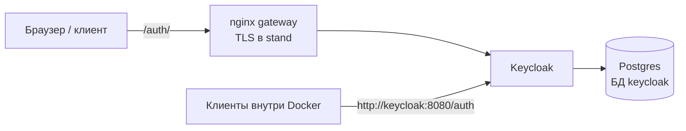

# Keycloak RAV5

Keycloak — единственный источник учётных записей и токенов платформы. Контур из трёх
контейнеров: Postgres (БД `keycloak`), Keycloak и nginx-шлюз, публикующий Keycloak по пути
`/auth`. Как проверять токены в сервисах —
[middleware.md](middleware.md).



## Что где лежит

| Путь | Назначение |
| --- | --- |
| `infra/keycloak/Dockerfile` | Оптимизированный образ Keycloak 26.7.1 (`kc.sh build`, relative path `/auth`) |
| `infra/keycloak/realm-rav5.json` | Realm `rav5`: роли, клиенты, демо-учётки; секреты и URL подставляются из окружения |
| `infra/postgres/init/01-keycloak.sh` | Роль и пустая БД `keycloak` |
| `infra/nginx/templates/gateway.{local,stand}.conf.template` | Шлюз для профиля; монтируется ровно один |
| `infra/nginx/snippets/` | `http-common.conf` — upstream и лимиты; `keycloak.conf` — буферы и location `/auth/`; `proxy-headers.conf` — заголовки прокси |
| `docker-compose.yml` | Профиль local; `docker-compose.stand.yml` — оверлей https |
| `scripts/gen-secrets.sh` | Случайные секреты в `.env` |
| `scripts/auth-smoke.sh` | Smoke-тесты |

## Запуск

```bash
cp .env.example .env
docker compose up -d --build     # http://localhost/auth/
```

Первый старт — 1–2 минуты: Keycloak создаёт схему в своей БД и импортирует realm.
Готовность — `healthy` у всех контейнеров в `docker compose ps`.

| | local | stand |
| --- | --- | --- |
| Адрес | `http://localhost` (`GATEWAY_PORT`) | `https://<домен>`; порт 80 → 301 на https |
| Запуск | `docker compose up -d --build` | `docker compose -f docker-compose.yml -f docker-compose.stand.yml up -d --build` |
| TLS, HSTS | нет | да, сертификат в `infra/nginx/certs/{fullchain,privkey}.pem` |
| Админка Keycloak | открыта (`ADMIN_ALLOW_CIDR=0.0.0.0/0`) | только с `ADMIN_ALLOW_CIDR` |

Для stand: `./scripts/gen-secrets.sh`, затем вручную `PUBLIC_URL`, `PUBLIC_HOST`,
`ADMIN_ALLOW_CIDR` в `.env`. Нужен Docker Compose 2.24+ (тег `!override`).

Вход с PKCE требует Web Crypto API, а он есть только в защищённом контексте: `https://…`
или `http://localhost`. Открывать local по IP машины нельзя — по сети только stand.

`PUBLIC_URL` зашивается в realm при первом импорте (`iss`, redirect URI). После смены
`PUBLIC_URL`, паролей в `.env` или правки `realm-rav5.json` нужен `docker compose down -v`.
Порт в `PUBLIC_URL` обязан совпадать с `GATEWAY_PORT`.

## Учётки

| Кто | Логин | Пароль (`.env`) | Где |
| --- | --- | --- | --- |
| Пользователь | `user@example.com` | `DEMO_USER_PASSWORD` | realm `rav5` |
| Администратор платформы | `admin@example.com` | `DEMO_ADMIN_PASSWORD` | realm `rav5` |
| Администратор Keycloak | `KC_ADMIN_USERNAME` | `KC_ADMIN_PASSWORD` | master-realm, `/auth/admin/` |

Администратор платформы и администратор Keycloak — разные учётки в разных realm.

## Postgres

- Один экземпляр Postgres 17. `01-keycloak.sh` создаёт роль `KC_DB_USERNAME` и пустую БД
  `keycloak` с этой ролью-владельцем; `CONNECT` для `PUBLIC` отозван.
- Схему Keycloak создаёт и обновляет сам при старте (Liquibase) — отдельного шага миграций нет.
- Суперпользователь `POSTGRES_USER` — только для администрирования: `make psql db=keycloak`.
- Скрипты `infra/postgres/init/` выполняются только на пустом томе. Другим потребителям
  этого Postgres достаточно положить рядом свой `NN-<имя>.sh` по тому же образцу.
- Postgres только в сети `internal` (без выхода в интернет), с хоста недоступен.

## Keycloak

- Realm `rav5`, локаль `ru` по умолчанию, регистрация открыта (email = логин), сброс пароля
  и подтверждение email выключены (в демо нет SMTP), защита от перебора включена,
  политика паролей `length(8) and notUsername`.
- Роли realm: `user` (входит в default-роль — её получает и каждый зарегистрированный),
  `admin`, `service`. Роли в токене — `realm_access.roles`.
- Клиенты:
  - `rav5-web` — публичный, authorization code + PKCE S256, redirect `${PUBLIC_URL}/*`,
    audience `rav5-api`, `rav5-sim` в access token;
  - `rav5-api-internal` — конфиденциальный, client credentials, роль `service`, audience
    `rav5-sim`, `rav5-economics`, секрет `KC_API_INTERNAL_SECRET`.
- Access token живёт 5 минут, SSO-сессия — 2 часа простоя, максимум 10 часов.
- `iss` всегда `${PUBLIC_URL}/auth/realms/rav5` — без слэша в конце, со схемой и портом как в
  `PUBLIC_URL`, в том числе для токенов, полученных по внутреннему адресу.
- Healthcheck — статус ответа `/auth/health/ready` на management-порту 9000 (200/503).
  Проверка через `grep UP` ложно срабатывает: тело DOWN-ответа содержит `"UP"` у проверки
  «Graceful Shutdown».

### Адреса для клиентов Keycloak

| Что | Снаружи (через шлюз) | Внутри Docker (сеть `edge`) |
| --- | --- | --- |
| Issuer | `${PUBLIC_URL}/auth/realms/rav5` | тот же (сверять побайтно) |
| Discovery | `…/auth/realms/rav5/.well-known/openid-configuration` | `http://keycloak:8080/auth/realms/rav5/.well-known/openid-configuration` |
| JWKS | `…/protocol/openid-connect/certs` | `http://keycloak:8080/auth/realms/rav5/protocol/openid-connect/certs` |
| Token endpoint | `…/protocol/openid-connect/token` | `http://keycloak:8080/auth/realms/rav5/protocol/openid-connect/token` |

Внутренние URL в discovery Keycloak отдаёт сам (`KC_HOSTNAME_BACKCHANNEL_DYNAMIC`).

### Как добавить роль

1. Добавить роль в `roles.realm` файла `infra/keycloak/realm-rav5.json` (и пользователям в
   `realmRoles`, если нужно).
2. `docker compose down -v && docker compose up -d --build` — или создать роль в админке на
   работающем стенде, но файл всё равно обновить.

## Шлюз

| Путь | Куда | Особенности |
| --- | --- | --- |
| `/healthz` | ответ nginx 200 | без логов |
| `/auth/realms/rav5/clients-registrations/` | 404 | Dynamic Client Registration закрыт |
| `/auth/admin/`, `/auth/realms/master/` | keycloak:8080 | только `ADMIN_ALLOW_CIDR` |
| `/auth/realms/rav5/protocol/openid-connect/token`, `…/login-actions/` | keycloak:8080 | `limit_req` 30/мин с IP, burst 30 |
| `/auth/` | keycloak:8080, путь без изменений | увеличенные буферы под заголовки Keycloak |
| всё остальное | 404 | |

- Management-порт 9000 (health, metrics) не проксируется.
- В `/auth/` не добавляются `X-Frame-Options` и CSP — Keycloak ставит свои. HSTS — в stand.
- upstream объявлен с `resolve` (nginx 1.28): шлюз стартует, даже если Keycloak ещё не поднят,
  и подхватывает новый IP контейнера после его перезапуска.
- Заголовки для Keycloak: `Host` с портом браузера, `X-Forwarded-For/Proto/Host`
  (`KC_PROXY_HEADERS=xforwarded`), `X-Request-Id`.

## Проверка

```bash
./scripts/auth-smoke.sh              # local
./scripts/auth-smoke.sh --restart    # + перезапуск Keycloak: шлюз и сессии переживают его
./scripts/auth-smoke.sh --insecure   # stand с самоподписанным сертификатом
```

| Проверка | Что подтверждает |
| --- | --- |
| T2 | шлюз жив |
| T3 | discovery: `issuer` = `${PUBLIC_URL}/auth/realms/rav5`, публичный `jwks_uri`, PKCE S256 |
| INT | по внутреннему адресу `issuer` тот же публичный, JWKS — внутренний, ключ RS256 |
| PG | БД `keycloak`, её владелец — не суперпользователь, чужие роли не подключаются, схема создана Keycloak |
| T4 | вход через форму на русском по PKCE, userinfo; неверный пароль отклонён |
| T7 | access token: `iss`, `aud` (`rav5-api`, `rav5-sim`), роль `user` без `admin`, 5 минут; ID token без `aud rav5-api` |
| T8 | у администратора платформы роли `user` + `admin` |
| T5 | самостоятельная регистрация, новый пользователь получает `user` |
| T14 | client credentials через шлюз и по внутреннему адресу: `iss` публичный, роль `service`; неверный секрет — 401 |
| T17 | DCR 404, health 404, пути вне `/auth` 404; в stand админка вне allowlist — 403 |
| T21 | пароли в БД — хэши (argon2) |
| T20 | после выхода refresh token недействителен |
| T22 | stand: 301 на https, HSTS |
| T18 | `--restart`: после перезапуска Keycloak шлюз работает без перезапуска, токен и сессия действуют |

Вход и регистрация эмулируют браузер через настоящие формы Keycloak; тестовые клиенты в
realm не добавляются.

## Известные ограничения

- Выход не отзывает выданный access token: он действует до `exp`, максимум 5 минут.
- Нет подтверждения email и сброса пароля — в демо нет SMTP.
- Администратор master-realm создаётся bootstrap-переменными; Keycloak помечает его временным.
- Один экземпляр Keycloak без отказоустойчивости.
- Лимит входа считается по IP и делится между пользователями за одним NAT.
- В токене, кроме `user`, есть стандартные роли Keycloak (`offline_access`,
  `uma_authorization`) и audience `account`.
- Холодный старт — 1–2 минуты; на сильно загруженной машине дольше (healthcheck терпит до ~8 минут).
