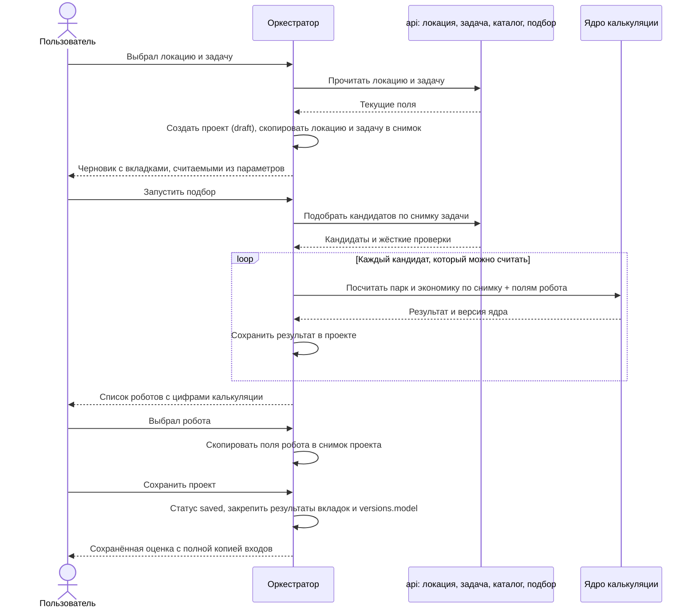
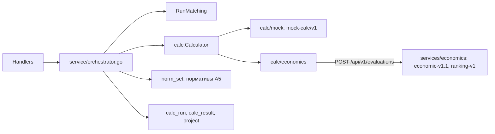

# Оркестратор проекта

Язык документа — русский. Имена сущностей, полей API и колонок БД — английские.
Смежные документы: [сервис api](api/README.md), [схема БД](api/db-schema.md),
[правила подбора](api/matching-rules.md),
[симуляция](../services/simulation/README.md).

## Зачем он нужен

Оркестратор управляет **жизненным циклом одного проекта**.
Он не считает экономику, не проверяет применимость робота и не гоняет симуляцию.
Он держит параметры проекта, по запросу пересчитывает вкладки оценки
и **закрепляет в проекте копии тех данных, по которым пользователь принял решение**.

Проект — не живая ссылка на локацию, задачу и робота.
Это **снимок полей** этих сущностей на момент, когда пользователь с ними работал,
плюс результаты калькуляции и версия ядра, которым эти результаты посчитаны.

Так оценка остаётся воспроизводимой: локацию потом поправили, в каталог добавили
робота, формулы калькуляции изменили — открытый старый проект показывает те же
цифры, что и в день решения.

## Канонические сущности

| Сущность | Смысл | Роль в проекте |
|---|---|---|
| **Location** | Профиль объекта: тип, параметры, персонал, бюджет, горизонт. | Источник входа. При создании проекта все поля копируются в снимок. |
| **Task** | Процесс, развёрнутый на локации: объёмы, ограничения, класс операции. | Источник входа. Копируется вместе с локацией. В проекте ровно одна задача. |
| **Robot / Solution** | Позиция каталога с ТТХ, capability и ценой. | Сначала участвует в подборе и калькуляции как кандидат. После выбора пользователя его поля тоже копируются в проект. |
| **Project** | Версионированная оценка: локация + одна задача + (после выбора) робот. | Хранит снимки, версии данных и ядра калькуляции, результаты вкладок и статус `draft` / `saved`. |
| **Orchestrator** | Прикладной модуль жизненного цикла проекта. | Создаёт и дополняет снимок, считает вкладки по параметрам проекта, принимает выбор пользователя, сохраняет проект. |

Локация и задача живут своей жизнью и могут меняться после создания проекта.
Проект продолжает смотреть на **свою копию**, пока пользователь явно не обновит снимок.

## Что входит в снимок проекта

Снимок собирается **поэтапно**, а не целиком в момент `POST /projects`.

```text
проект
├── snapshot.location      ← копия локации и её параметров на момент создания
├── snapshot.parameters    ← значения параметров объекта с источниками
├── snapshot.task          ← копия задачи на момент создания
├── snapshot.robot         ← копия выбранного робота; появляется после выбора
├── versions.catalog       ← версия каталога на момент закрепления
├── versions.dictionaries  ← версия справочников на момент закрепления
├── versions.model         ← версия ядра калькуляции; пишется при сохранении
└── calc_run[]             ← расчёты подбора (история, не пересчитываются молча)
    ├── request            ← замороженный вход: снимок + поля всех кандидатов
    └── calc_result[]      ← цифры по каждому роботу и модели приобретения
```

Копируются **значения полей**, а не только идентификаторы.
Идентификаторы локации, задачи и робота остаются как ссылки «откуда взяли»,
чтобы показать, что исходник изменился (`dataChanged`, `catalogUpdated`).
Расчёты и экран проекта читают снимок, а не живые записи.

### Когда что копируется

1. **Создание проекта.** Пользователь выбирает локацию и задачу.
   Оркестратор копирует в проект все поля локации (включая параметры типа объекта
   и группы персонала) и все поля задачи (включая источники значений).
   Робота в снимке ещё нет.
2. **Подбор.** Оркестратор запускает жёсткие проверки, затем калькуляцию
   по кандидатам каталога. У каталога нет истории, поэтому поля каждого
   кандидата (карточка, ТТХ, строка класса, оффер с ценой) замораживаются
   во входе расчёта `calc_run.request`. Результаты лежат рядом в `calc_result`
   вместе с версией ядра. В `snapshot.robot` ничего не пишется:
   пользователь ещё не выбрал конфигурацию.
3. **Выбор робота.** Пользователь выбирает кандидата по результатам калькуляций.
   Оркестратор копирует в `snapshot.robot` поля этого робота **из
   `calc_run.request`, а не из живого каталога**: карточку, ТТХ, строку
   capability по классу задачи, предложение с ценой, модель приобретения.
   Так в проекте оказываются ровно те поля, на которых посчитаны показанные цифры.

Живой каталог после выбора может измениться. В проекте остаётся копия робота
на момент выбора, как и копии локации и задачи на момент создания.

## Жизненный цикл



У проекта два статуса — это не шаг воронки, а сохранён ли он:

| Статус | Смысл |
|---|---|
| `draft` | Черновик. Параметры можно менять, вкладки пересчитываются из текущего снимка. |
| `saved` | Сохранённая оценка. Снимок, выбранный робот, результаты вкладок и `versions.model` закреплены. |

Подбор, симуляция, экономика и итог — **вкладки**, а не статусы.
Каждая вкладка — представление, которое оркестратор считает из параметров проекта
(снимка локации, задачи и, после выбора, робота). Переключение вкладки статус
не меняет: можно открыть экономику, вернуться к подбору, поправить условие —
проект остаётся `draft`, пока пользователь его не сохранит.

Прежняя цепочка статусов `params → matching → simulation → economics → result`
заменена миграцией `0006_orchestrator.sql`: `result` стал `saved`, остальные — `draft`.

## Вкладки

Все вкладки читают один и тот же снимок. Меняются параметры проекта — меняется
вход всех вкладок; устаревший результат вкладки нужно пересчитать, а не считать
его отдельным «этапом проекта».

| Вкладка | Что показывает | Откуда берёт вход | Кто считает |
|---|---|---|---|
| Параметры | Локация, задача, условия подбора | Снимок проекта | оркестратор (копия полей) |
| Подбор | Кандидаты, проверки, цифры калькуляции | Снимок локации и задачи | api (проверки) + ядро калькуляции |
| Симуляция | Проверка выбранной конфигурации | Снимок + выбранный робот + результат калькуляции | `services/simulation` |
| Экономика | CAPEX, OPEX, эффект, окупаемость выбранного робота | Тот же снимок; после симуляции — принятые поправки | ядро калькуляции |
| Итог | Сводка решения | Сохранённые результаты остальных вкладок | оркестратор (сборка) |

## Подбор и калькуляция

На вкладке «Подбор» оркестратор делает два разных вызова.

**Подбор** (уже реализован в `services/api`) отвечает на вопрос
«какой робот технически применим к этой задаче».
Ключ — класс операции задачи. Дальше жёсткие проверки: способ обработки, среда,
груз, проезд, температура, высота подъёма, наличие цены.
Кандидат получает состояние `passed`, `needs_verification` или `excluded`.

**Калькуляция** отвечает на вопрос «что будет, если поставить этого робота
на эту задачу в этой локации»: размер парка, CAPEX, OPEX, эффект, окупаемость.
Её считает ядро калькуляции (сервис economics / модель расчёта), не оркестратор.

Оркестратор запускает калькуляцию **для каждого типа робота из каталога,
который попал в подбор** — то есть имеет capability того же класса операции,
что и задача, и не отсечён как заведомо неприменимый.
Робот без нужного класса в список подбора не входит и не считается.
Исключённые по жёстким проверкам можно досчитать только если пользователь
добавил их вручную.

Вход калькуляции — поля из снимка проекта (локация и задача) плюс текущие поля
робота-кандидата из каталога той версии, которая закреплена в проекте.
Выход — сохраняется в проекте как результат этой пары «проект × робот × версия ядра».

Цифры экрана «Подбор» (число роботов, CAPEX, балл, окупаемость) оркестратор
кладёт поверх результата matching-run. Сам api этих цифр не считает.

## Версия ядра калькуляции

В проекте обязательно хранится **версия ядра калькуляции** (`versions.model`).

Это не версия каталога и не версия справочников.
Это идентификатор реализации формул: набор формул, нормативов и правил округления,
которым посчитаны сохранённые результаты.

Зачем:

- формулы ядра со временем меняются;
- старый проект должен показывать **тот же результат**, что видел пользователь;
- молча пересчитывать историю новым ядром нельзя.

Правила:

1. Результат калькуляции сохраняется вместе с `model_version`, которой он посчитан.
2. Открытие старого проекта читает **сохранённые** результаты. Ядро заново не вызывается.
3. Если текущее ядро новее закреплённого, проект может показать, что модель обновилась.
   Пересчёт — отдельное явное действие пользователя. Он создаёт новые результаты
   и новую закреплённую версию, старые не затирает молча.
4. Сравнение «как было / как стало бы на новой модели» допустимо только как
   отдельный просмотр, не как замена исторических цифр.

Рядом с версией ядра проект уже закрепляет `catalog_version` и `dictionaries_version`.
Вместе это полный конверт воспроизводимости: какие входы, какой каталог, каким ядром считали.

## Границы модуля

**Делает оркестратор**

- Создаёт проект (`draft`) и заполняет снимок локации и задачи.
- Считает вкладки из параметров проекта и складывает их результаты в проект.
- Принимает выбор пользователя и копирует поля выбранного робота в снимок.
- Переводит проект в `saved`: закрепляет снимок, результаты вкладок и версию ядра.
- Отдаёт фронтенду состояние проекта: статус, снимок, вкладки, выбор.

**Не делает оркестратор**

- Не владеет справочниками, каталогом, CRUD локаций и задач — это `services/api`.
- Не реализует жёсткие проверки применимости — это `internal/matching`.
- Не содержит формул парка и экономики — это ядро калькуляции.
- Не считает рейтинг, если скоринг выделен в отдельный модуль: оркестратор
  только вызывает его и сохраняет ответ.
- Не считает симуляцию рабочего дня — это `services/simulation`.
- Не рисует отчёт и не занимается авторизацией.

## Реализация

Оркестратор — сценарии в [`services/api/internal/service/orchestrator.go`](../services/api/internal/service/orchestrator.go)
поверх подбора. Калькуляция закрыта портом [`internal/calc`](../services/api/internal/calc/calc.go):
оркестратор не знает, чем считают.



### Эндпоинты

| Метод и путь | Что делает |
|---|---|
| `POST /api/v1/projects` | Черновик `draft`, копия локации и задачи в снимок |
| `POST /api/v1/projects/{id}/evaluate` | Подбор по снимку и расчёт кандидатов для `purchase` и `raas`; тело `calcOverrides` — «Параметры расчёта» проекта; выбор переносится на новый расчёт или снимается |
| `GET /api/v1/projects/{id}/evaluation` | Последний расчёт как сохранён; флаги `stale` и `modelOutdated` |
| `PUT /api/v1/projects/{id}/selection` | Выбор робота из актуального расчёта, копия его полей в `snapshot.robot` |
| `POST /api/v1/projects/{id}/save` | `draft` → `saved`: закрепляет выбор, расчёт и `versions.model` |
| `POST /api/v1/projects/{id}/reopen` | `saved` → `draft`; прежние расчёты остаются в истории |
| `GET /api/v1/projects/{id}/snapshot` | Снимок целиком, с `robot` после выбора |
| `GET /api/v1/norms`, `GET /api/v1/norm-sets[/{id}]` | Текущие нормативы А5 и их версии |
| `POST /api/v1/norm-sets` | Новая версия нормативов (admin); сумма весов рейтинга — 100 |

В `saved` изменения входов отклоняются ответом 409 `project_saved`: подбор, расчёт, условия, ручные кандидаты, выбор, обновление снимка и горизонт. Название менять можно.

### Параметры расчёта

Панель «Параметры расчёта» шага «Подбор» (PRD 11.3, ТЗ 3.5.3) правит семь входов только в этом проекте: `project.calc_overrides`,
тело `POST …/evaluate`. Снимок, локация и каталог не меняются. Во вход калькулятора идут оклад исполнителей
(ФОТ задачи пересчитывается), часы работы, цена единицы и обслуживание выбранного решения (`solutionId`; обслуживание —
доля от цены по парку прошлого расчёта) и горизонт. Рейсы в час и загрузка парка сохраняются и показываются,
но модель экономики их пока не принимает. Исходные значения полей замораживаются во входе расчёта
(`calc_run.request.defaults`) и отдаются как `Evaluation.calcDefaults`.

### Устаревание расчёта

У проекта есть счётчик `inputs_version`. Он растёт при каждом изменении входа расчёта: обновление снимка, условия подбора, ручные кандидаты, горизонт. Расчёт запоминает счётчик на момент запуска. Если значения разошлись, расчёт `stale`: выбрать робота из него и сохранить проект нельзя (409 `evaluation_stale`).

### Калькулятор

- По умолчанию (`ECONOMICS_URL=http://economics:8002` в compose) считает сервис economics. Клиент [`calc/economics`](../services/api/internal/calc/economics/client.go) говорит на родном контракте сервиса: `GET /api/v1/model-version`, затем `POST /api/v1/evaluations`. Таймаут каждого вызова — `ECONOMICS_TIMEOUT` (по умолчанию 10 с, ТЗ 4.3.2).
- `ECONOMICS_URL=` (пусто) — встроенная мок-модель [`calc/mock`](../services/api/internal/calc/mock/mock.go), версия `mock-calc/v1`: для отладки api без Python. Рейтинга и статей затрат у неё нет.
- Контракт — [`packages/contracts/openapi/economics.yaml`](../packages/contracts/openapi/economics.yaml). Его выгружает сам сервис (`python scripts/export_openapi.py` в `services/economics`), тест economics не даёт ему разойтись с кодом.

Что делает клиент (подробно — в [отчёте об интеграции](economics/integration-report.md)):

1. **Вход.** Снимок проекта превращается в `EvaluationRequestDto`: задача — из `task.params` и `task.derived`, смены и доступная мощность — из параметров локации по ролям, 32 норматива и 8 весов рейтинга — из закреплённой версии нормативов, кандидаты — из карточек `calc_run.request`. Числа уходят строками, чтобы pydantic читал их в `Decimal` без погрешности.
2. **Предпроверки.** Нет объёма, часов, пика, доли автоматизации, маршрута или массы груза либо горизонт меньше 5 лет — сервис не вызывается, результаты «не рассчитано» с причиной. Нет кандидатов — сервис не вызывается.
3. **Допущения.** Пустые время погрузки, разгрузки и мощность робота берутся из нормативов с предупреждением и записью в `details.assumptions`. Скорости по нормативу нет: без неё робот остаётся «не рассчитано».
4. **Выход.** Метрики по кодам → поля `calc_result`; статьи CAPEX и OPEX, базовый сценарий «текущий процесс», критерии рейтинга и допущения → `details`; трасса и риски — на русском.
5. **Ошибки.** Сеть, 5xx и неразборчивый ответ → `calc.ErrUnavailable` → 503 `calculation_unavailable`. 409 и 422 → `calc.ErrRejected` → 503 `calculation_rejected`. В обоих случаях прогон подбора сохранён.

### Нормативы

Нормативы экрана А5 (PRD 6.8) хранятся в api: таблицы `norm_set` и `norm_value`, определения и значения первой версии — [`domain/norms.go`](../services/api/internal/domain/norms.go). Версия неизменна: правка администратора (`POST /api/v1/norm-sets`) создаёт следующую. Проект закрепляет последнюю версию при создании и при `refresh-snapshot` (`project.norm_set_id`, `versions.norms`), флаг `normsUpdated` сообщает о более новой. Весь набор замораживается во входе расчёта, поэтому старый расчёт воспроизводим и после правки нормативов.

## Инварианты

1. В проекте ровно одна задача и одна локация.
2. Статус проекта — только `draft` или `saved`. Вкладки статусом не являются.
3. Все вкладки считаются из снимка проекта, а не из живых локации, задачи и каталога.
4. Робот появляется в снимке только после явного выбора пользователя.
5. Калькуляция на вкладке «Подбор» идёт по кандидатам каталога с нужным классом операции.
6. У каждого сохранённого результата есть `model_version`.
7. Смена формул ядра не меняет цифры проектов в статусе `saved`.
8. Обновить снимок (`refresh-snapshot`) или пересчитать вкладку можно только в `draft`.
   Для `saved` сначала нужен `reopen`; новый расчёт не затирает прежний.
9. Выбор робота всегда относится к последнему актуальному расчёту. Новый расчёт переносит выбор
   на свой результат, если выбранная пара «решение + модель» снова посчитана (D-89), иначе снимает его;
   обновление снимка и смена задачи выбор снимают.

## Зависимости

```text
apps/web
    → оркестратор (жизненный цикл проекта)
        → services/api          снимок, подбор, каталог, evaluation-context
        → ядро калькуляции      парк, CAPEX/OPEX, эффект, окупаемость
        → services/simulation   вкладка «Симуляция»: проверка выбранной конфигурации
```

Вход в калькуляцию — `calc.Request`: часть снимка (локация, параметры, задача
с производными показателями) и поля кандидатов подбора. Для внешних потребителей
остаётся `GET /api/v1/projects/{id}/evaluation-context`.

Вход в симуляцию — выбранная конфигурация (число роботов и станций из калькуляции)
и поля локации/задачи из снимка. Денег симуляция не считает: оркестратор
передаёт принятые поправки обратно в калькуляцию.

## Принятые решения

1. **Где живёт оркестратор.** Модуль внутри `services/api`: так он использует
   те же проверки доступа и транзакции, что и остальные сценарии проекта.
2. **Где хранятся результаты и копия робота.** Результаты — таблицы `calc_run`
   и `calc_result`: числа в типизированных колонках, `trace` и вход расчёта — JSONB.
   Копия робота — поле `robot` в `project.snapshot`.
3. **Кого считать.** Прошедших и требующих проверки; исключённых — только добавленных вручную.
4. **Модели приобретения.** `purchase` и `raas`, если робот их предлагает
   (пустой список моделей в каталоге — обе).
5. **Формат `model_version`.** Строку задаёт калькулятор: `mock-calc/v1` у мок-модели,
   `economic-v1.1` у сервиса economics (`GET /api/v1/model-version`). Одна на весь расчёт.
   Методика рейтинга хранится рядом — `calc_run.ranking_version` (`ranking-v1`).
6. **Рейтинг.** Балл и место считает сервис economics (`ranking-v1`) с весами из нормативов
   проекта. Балл в API — от 0 до 1; места перенумерованы по показанным парам «решение + модель».

## Что дальше

- Вкладка «Симуляция»: вызов `services/simulation` для выбранного робота
  и пересчёт экономики по принятым поправкам.
- Чувствительность ±20 % и what-if проекта — после стабильной идентичности сценариев в economics (REL-002).
- Бэклог интеграции — в [отчёте](economics/integration-report.md).
